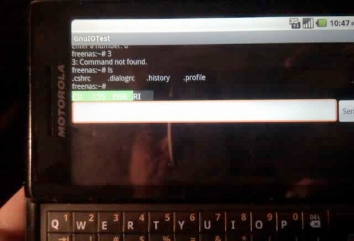

Just ported the RXTX library to the Android platform.    

Check out the picture below, it shows the Motorola Droid phone talking to the FreeNAS device over the serial port.

Reference-style:

Testing android with serial



More information and binaries are here http://v-lad.org/projects/gnu.io.android/.   The source code of port is here  https://github.com/vladistan/gnu.io.android/ .

If you have any questions, comments or support request post them below.
