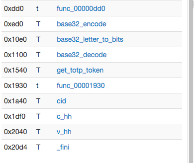
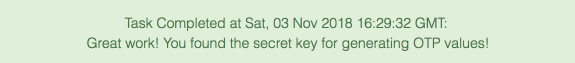

Let's look at Task 2 before doing Task 1.  It is a much quicker and easier task, and it is a good warm-up practice in reverse engineering before we dive into the much more complicated Task 1.


In this task we are asked to extract a secret key from the binaries left over by the ransomware.  To solve this we need to use some reverse engineering tools.

The organizers of recommend [IDAPro](http://bit.ly/2ST8vgN) or [Binary Ninja](http://bit.ly/2FgVYAk).  IDAPro is indeed an excellent tool, but unfortunately in order to get the full functionality you have to buy the complete version which is quite pricey.  I have never used the Binary Ninja,  looks like a good tool, but also expensive.

To keep this accessible to everyone I have opted for the free tools  [Dissasembler.io](http://bit.ly/2Fpufwz) and [Radare](http://bit.ly/2sgwURE)

The first one is a web application,  you don't need anything to install. The second one is an open source tool which is a package with many distributions.  For example, on Mac you can use the excellent [Homebrew](http://bit.ly/2D2iVFf) package manager to install it.

```
brew install radare2
```

Radare will come in handy for Task 1.  In this task we'll stick with [Dissasembler.io](http://bit.ly/2Fpufwz).  

Let's start.

1. Download libclient_crypt.so
* Open [Dissasembler.io](http://bit.ly/2Fpufwz) in your browser
* Click on the start disassembling button that looks like this. 
* Once the app loads, upload your *libclient_crypt.so* file.
* After a short time your file will be disassembled and you'll see the  screen like this, 
  with the symbols pane on the left and the code pane on the right.  
* Scroll all the way down on the symbols pane. 
* Most functions names are self-explanatory, except for the one that is called *func_00001930*, this looks suspicious. Click on it's name to see the code. 
* These *MOVB* instructions look interesting. Seems like this function is writing a sequence of byte values to a memory location.
* So, what's can we say about these bytes?  We see that these values range between 0x30 and 0x59, which covers digits 0 and uppercase letters.
* Let's refresh our memory about Base32 encoding [here](http://bit.ly/2TF6sN3) and [here](http://bit.ly/2SQ5Fcc).
* We see that the most common form of Base32 encoding uses uppercase letters A-Z and numbers 0-9.
* Most likely this is what we want.
* Let's convert these hex values to their ASCII representation to get the string *CAYPFE6MG2DJT4EB5RIZLIAYFJAUGL3L*
* Let's submit it to the challenge
* Voila! 

## Additional reading materials

If you want to find out more about the way we identified our suspect function so quickly,
check out these reading materials.

* Very comprehensive series of posts about linkers and shared libraries [https://www.airs.com/blog/page/4?s=linkers](http://bit.ly/2D3nLBS)
* [Linkers and loader](https://amzn.to/2VHxBkq) by John R. Levin -- very comprehensive overview of linkers, loaders and shared libraries.  Somewhat dated, but things haven't changed that much since 2000


Let's move on to [Task 1](../codebreaker2018_task1)
