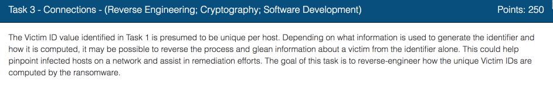
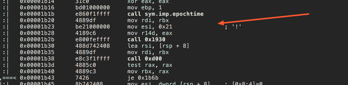
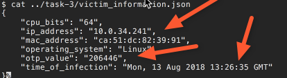
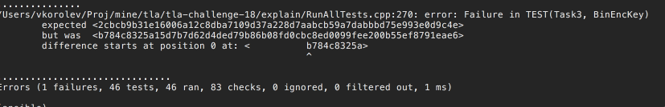

While solving [Task 1](../codebreaker2018_task1), we didn't reverse engineer the CID function.  This time we will. Again, we'' be using Radare.

Looks like it uses `epochtime`, and then calls unnamed function.  Most likely that's the OTP calculation.

Aha, looks like it is a SHA256 HMAC signature calculation.  It uses the same secret key that we recovered in [Task 2](../codebreaker2018_task2)

`cid = HMAC( 'IP_ADDR | OTP')`

The full implementation of the function with the tests is [here](http://bit.ly/2H8TrtR).
Note that in our test cases we have used the IP address and the OTP values that we have recovered in [Task 0](../codebreaker2018_task0) and [Task 1](../codebreaker2018_task1).

All we need now is too look at the `victim_information` file to get the new values for `IP address` and `OTP`.

Then enter them as the input of the test case. [Here](http://bit.ly/2D5FJUp) is the example.

Let's run the model again with the new values.

The test case is failing,  but we do now have the new CID value for the other victim. We can submit it now.

Let's got to [Task 4](../codebreaker2018_task4)
