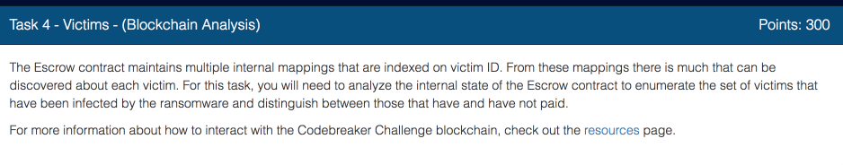

Now we need to find out who the the other victims are.  To solve this task, we need to have some understanding of how blockchain works.

Before starting this challenge, I had absolutely zero knowledge about the blockchain. It took me about two weeks to learn the tools and gain proficiency.  It's not that hard,  but some basic understanding of cryptography is helpful.

The best resource that I found is Will Button's course [Learning Blockchain Application Development](http://bit.ly/2FvKb0j).  This course is about 3.5 hours of video lectures and takes about a day to finish if you follow the course step by step and do all the projects together with him.  

Another good resource is Jan-Erik Sandberg [Blockchain Fundamentals](http://bit.ly/2CnLJ9M) on PluralSight.  

Once you cover these introductory materials, read the following articles

  * [Getting Deep Into Ethereum: How Data Is Stored In Ethereum?](http://bit.ly/2Fxivbl) - it is very detailed and technical.  You can just skim it, no need for complete grokking of the material.  However, at least surface level understanding of the material is essential for solving this task.

  * [How to read Ethereum contract storage](http://bit.ly/2CnxzFh) - less technical than above.

I developed a [Jupyter notebook](http://bit.ly/2CkZKF6) that lets you poke around different pieces of the blockchain.  You can download the notebook from above link and run it on your own computer.  Or you can use [this version](http://bit.ly/2D12FnY) to run it on Google Collaboratory platform without downloading or installing anything.

Let's start solving the problem.

Open the exploratory notebook, and find in the *Settings* section find the cell that looks like this.

  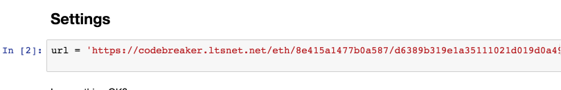

Replace the value of URL with the one given to you in the file called `blockchain_information.txt`.

Then execute next cell to verify that everything is configured properly and you can connect to the blockchain.

   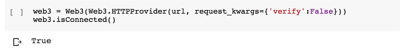

Keep executing the cells, until you get to the section called *Constants*

  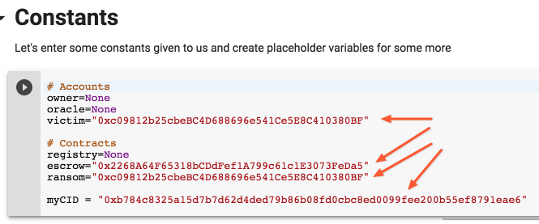

In this section, change the values of victim, escrow, ransom and victim_id with the values given to you in the files `ransom_note.txt` and `blockchain_information.txt`

In the `blockchain_information.txt` you find the value for the address of your victim account. Put it into the `accounts` section

  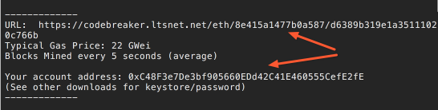

In the `ransom_note.txt` you will find the rest of the values

  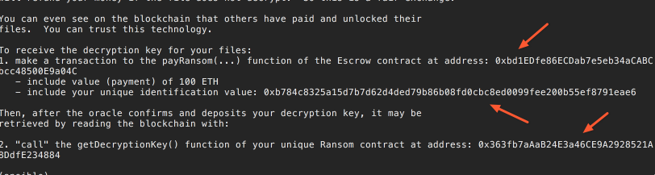

Do not touch the variables that are assigned value of `None`. We will get these values through the blockchain examination.

### Now on to the solution.

If you have read all the material above, you'll understand that all the storage variable of Ethereum smart contract are stored on the blockchain and are publicly available for reading by anyone. The `private` modified used by Solidity language is just a syntactic sugar.

Let's take a look at some simple variables of the escrow.

  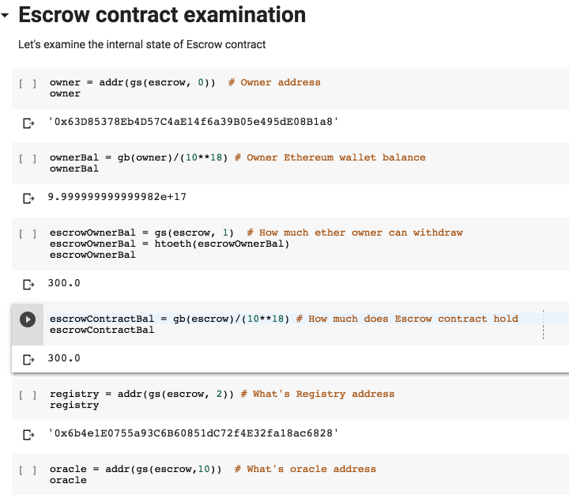

Now, let's take a look at the Ransom contracts that Escrow knows about

  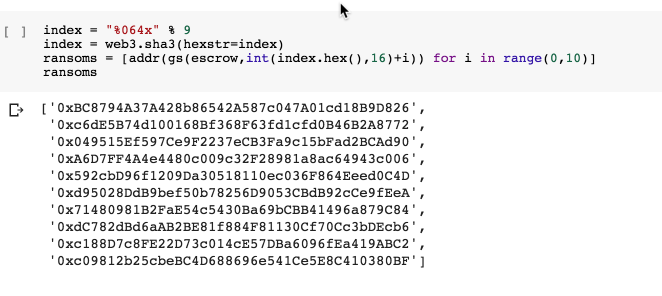

We have almost got a solution to the task.  We know the ransom contract address for each victim, but the assignment asks for `victim_id` not the contract address.  So let's look them up in the `ransom_map` mapping.

  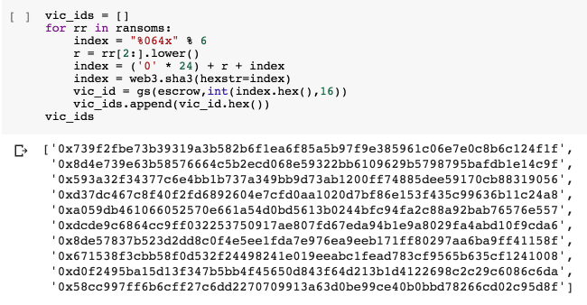

Great, we have found all the victim `ids`.  All that's left is to identify which victims have already paid the ransom and which have not. Let's look those up in `vicToPayer` map.

  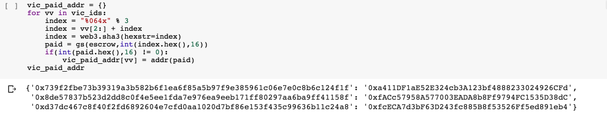

Now we have gathered all the answers.

Let's submit the IDs victim of the victims who have paid and  of the ones who have not.

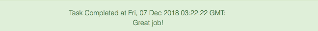

And now on [Task 5 Containment](../codebreaker2018_task5)
