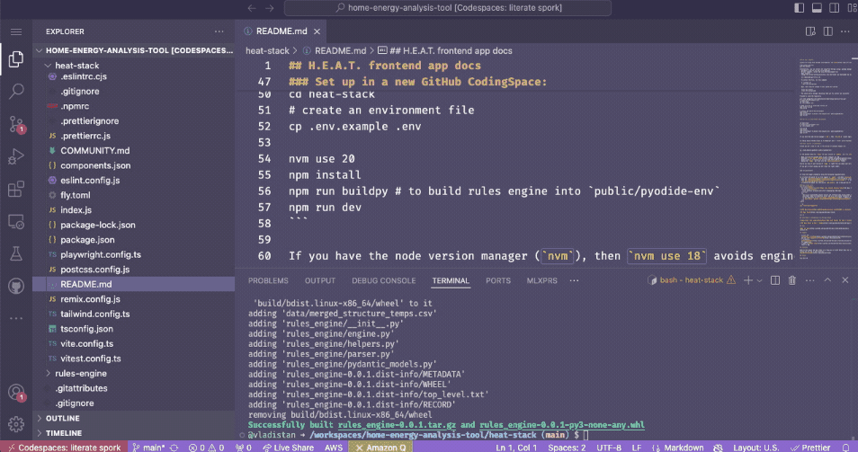

These days, there is a multitude of development tools such as
interpreters, virtual machines, package managers, test runners, and
build tools. For any particular step in the software development
life cycle, there are about three different tools available, each
having about ten versions. This makes it great to set things up
exactly as you want them. Unfortunately, this also makes it hard
for different developers to collaborate on the same project. It's
rare that two unrelated projects use the same setup. Even if they
were built by the same person, as new tools come out all the time
but older projects are usually not updated. This makes it even
harder to collaborate with other people. Chances are, if you just
clone somebody's GitHub repository, it is not going to work out of
the box and some tweaking is needed. Getting your environment set
up after cloning the repo could easily involve an hour or two of
Google and Stack Overflow searching, especially when the project
uses an unfamiliar tool that, for some reason, doesn't work right
in your setup. While tweaking your setup to work on the new project,
you might break the other projects that you are working on. It's a
mess.


Coutersy of [xkcd](https://xkcd.com/198/)

### We can just have everyone use the same setup, right?

In many large organizations, you probably receive a standard-issued
laptop or workstation with all the tools and environments already
pre-configured by your platform team. If you're not part of the
platform team, don't have hobby projects, and don't collaborate
with anyone outside your organization, you might not need to worry
about setting up development environmentsyou can stop reading now.
But if you're interested in exploring new tools, working on personal
projects, or collaborating with others beyond your company, keep reading.


### What about open source and small teams?

Standardized setup is great for large organizations with platform
teams that can configure the development environment for all developers.
But, what about small teams and open source projects?

When developers encounter a persistent problem, especially one that's
highly frustrating, the open-source community responds by
creating tools to address it. This is exactly what happened with
the problem of setting up development environments. Now we have numerous tools
to help us with this.

- [npm](https://www.npmjs.com/): Simplifies managing JavaScript packages.
- [Maven](https://maven.apache.org/): Manages Java dependencies.
- [Gradle](https://gradle.org/): Another build tool for Java.
- [Pyenv](https://github.com/pyenv/pyenv): Manages multiple Python versions.
- [Poetry](https://python-poetry.org/): Handles Python dependencies and virtual environments.

These tools are great for taking care of libraries and dependencies,
and letting us focus on writing code. But they don't cover everything.
They often don't handle pre-commit checks, linters, or multi-project
setups. Plus, they don't version themselves (though Gradle does)
or the language interpreterlike the JVM for Java or the Python
interpreter.

On top of that, your projects might rely on non-programming language
dependencies like databases, cache, and queue servers. You might
need [PostgreSQL](https://www.postgresql.org/),
[MariaDB](https://mariadb.org/), or [Redis](https://redis.io/) for
your application. While some projects include minimal setups of
these tools, these are usually only suitable for unit tests and
don't reflect how they're configured in a production environment.

### Side step, web based code editors

Since its creation in 2015, Visual Studio Code (VSCode) has become
the most popular code editor available. In addition to the installable
desktop version, there's a web-hosted version accessible at
[vscode.dev](https://vscode.dev), offering the same powerful features
directly in your browser. Moreover, GitHub provides an instant
web-based editor; by simply changing the `.com` in a GitHub repository
URL to `.dev`, you can open the repository in an editor at
[github.dev](https://github.dev). These browser-based editors are
excellent for quickly making changes or submitting patches to a
GitHub repository without the need for a full local setup.


### But editor is not enough, we need to run, test and debug our code

While web-based code editors are excellent for quick edits, software
development is much more than just editing code. This is where GitHub
Codespaces come in. Unlike simple web-based editors, Codespaces provide
complete development environments with full access to the command
line and development tools.

Launching a Codespace requires no setup or configuration. On any
GitHub repository whether it's your own or a public one, simply
click the 'Code' button and then select 'Codespaces'. That's it! 
See the screencast below for illustration.

Once you launch the Codespace, you get your own container attached 
to the web based editor where you can install and run all
the tools you need using the integrated terminal. 

If you project requires a lot of compute power you can upgrade to a more
powerful machine with 4 or 8 cores.

Keep in mind that this service is not free; it's billed based
on your usage time.  The billing is explained in more detail in the
section below.


### Understanding the Codespaces Lifecycle

GitHub Codespaces operates in three primary states: **Running**,
**Suspended**, and **Destroyed**.  These states are explained below:

1. **Running State**: When you launch a Codespace and interact with
it, it's in the running state. Your Codespace continues to run even
when you close the browser tab.  Once you re-open it, you will find
everything as it was when you left it, including all editors and
terminals.  This makes it easy to pick up where you left off without
losing any progress or context.

2. **Suspended State**: If your Codespace has been idle for a while,
it transitions into a suspended state. In this state, the container
stops and doesn't consume any CPU or RAM resources. However, the
filesystem content remains intact. All the tools you've installed,
configuration changes, and source code edits are preserved. When
you're ready to resume work, you can easily revive the suspended
Codespace.  To wake up a suspended Codespace, navigate to the **Codespaces** 
tab and launch the existing Codespace.  Note that any processes
that were running before suspension such as dev servers will 
need to be restarted.

4. **Destroyed State**: If a Codespace hasn't been used for a few
weeks, it's reclaimed and enters the destroyed state. All changes
made within the container are lost. To prevent losing unsaved work,
it's important to push your code and changes to the repository
regularly. 


### Understanding Codespaces Billing

While GitHub Codespaces provides a powerful cloud-based development
environment, it's important to be aware of the costs associated
with its usage to prevent the unexpected charges.

1. **Billing for Running Codespaces**: You are billed for every
minute your Codespace is in the **Running** state. This includes
time when the Codespace is active, even if you're not actively using
it. Or do not even have a browser tab open it.

2. **Monthly Time Allocation**: Each GitHub account receives a fixed
time allocation of Codespaces usage per month. If you exceed this
allocation, you will be billed for the additional time according
to GitHub's pricing.

3. **Storage Costs**: Each account also has a certain amount of
Codespaces storage allocated per month. If you use more storage
than your allocated quota, you will incur additional charges.

The exact allocations for compute time and storage depend on 
your account type (e.g., Free, Pro, Teams,
or Enterprise). For detailed information, look at the [GitHub
Codespaces Billing
Documentation](https://docs.github.com/en/billing/managing-billing-for-your-products/managing-billing-for-github-codespaces/about-billing-for-github-codespaces).

4. **Preventing Extra Charges**: To prevent extra charges and unpleasant surprises:

   - **Stop Your Codespaces**: Always stop your Codespaces when
   you're not using them. If you frequently launch new Codespaces
   and let them go idle automatically after a timeout, the cumulative
   running time could add up to a significant amount.
   
   - **Adjust Timeout Settings**: You can adjust the idle timeout
   settings for your Codespaces to control how quickly they transition
   to a suspended state when not in use.

   **Set Spending Limits**: To control costs, you can set a hard
   spending limit within your GitHub account settings. This limit
   prevents you from accidentally incurring charges beyond a specified
   amount.


### But, I need to work on the web app


When working on web applications, the need to interact with your
app using local tools like a browser or API clients such as Postman
is essential. You might think that an isolated container running
on a remote server won't allow this kind of interaction. However,
this is where **port forwarding** comes into play. Port forwarding
enables you to map ports from your app running in the remote container
directly to your local machine. This means you can access your web
application through your local browser or Postman just as if it
were running locally. Tools like Codespaces and Dev Containers
support automatic port forwarding, making it seamless to develop,
test, and debug your web applications remotely while interacting
with them using your familiar local tools.




### But, my app requires Python/Java/Node/PHP/Rails ?


If your app requires a complex runtime like Django, J2EE, Rails,
or PHP, do you need to install everything every time you launch the
Codespace?

No. As mentioned above, Codespaces are backed by containers, so you
can choose the container image that will be used as the base for
your Codespace. The base container image includes all the necessary
language tools and application servers. When the Codespaces environment
is launched, the code from your repository is checked out into the
created container.


### But, app containers are terrible as development environments

Runtime containers used to serve applications are often extremely
minimalistic, including only what's necessary to run the application.
They exclude development tools, linters, and fancy shells like
[oh-my-zsh](https://ohmyz.sh/). In fact, it's considered good
practice to use stripped-down, container-based OS distributions
like [Alpine Linux](https://alpinelinux.org/) that contain the bare
minimum needed. However, these spartan environments are not ideal
for development purposes.

That's where [Dev Containers](https://containers.dev/) come into
play. Unlike runtime containers, Dev Containers are feature-rich
environments packed with all your development tools, editors,
linters, and more. They provide a luxurious setting for development
compared to the minimalism of runtime containers.

To get started, there is a growing collection of [Dev Container
Templates](https://containers.dev/templates) available. To configure
your repository to use a particular Dev Container, create a
`.devcontainer` folder in the root of your repository and add a
`devcontainer.json` file. The contents of this file should look
something like this:

```json
{
    "image": "mcr.microsoft.com/devcontainers/javascript-node:20"
}
```


### But, I need to to use my favorite tool that is not available in the container

Yes, Dev Containers are great; they come with a variety of
development tools pre-installed. But, no matter what container template
you choose there is a good chance that it will miss a few 
of your favorite tools like [ed](https://www.gnu.org/fun/jokes/ed-msg.html). 
Does it mean that you have to build your own container image just to add these missing tools?

This could lead to a messy situation where everyone creates
their own container for minor tweaks, resulting in a proliferation
of nearly identical containers. 

For instance, suppose you find a container that includes
[PNPM](https://pnpm.io/), [DENO](https://deno.com/) and
[Fish](https://fishshell.com/) all tools you need but it also
includes Python 2.7, which isn't compatible with your project's
requirement for Python 3.9. In this case, that container is useless
to you. And you have to start from scratch and create your own
container, just to replace the version of Python.

This is where **Dev Container Features** come to help. Features allow to add extra tools to the existing containers in a modular way, letting us mix and match exactly what we need without the overhead of maintaining custom container images. 

Below is an example of a `devcontainer.json` file that uses a Dev Container Features to add the [oh-my-zsh](https://ohmyz.sh/) shell, set it up
with the [robbyrussell](https://github.com/robbyrussell/oh-my-zsh/wiki/Themes#robbyrussell) theme and also adds a number of JQ like tools such as [`jq`](https://stedolan.github.io/jq/), [`yq`](https://mikefarah.gitbook.io/yq/), [`gojq`](https://github.com/itchyny/gojq), and [`xq`](https://kislyuk.github.io/yq/#xq).


```json
{
  "name": "Plain Python 3.11",
  "image": "mcr.microsoft.com/devcontainers/python:3.11",
  "features": {
    "ghcr.io/devcontainers/features/common-utils:2": {
      "configureZshAsDefaultShell": "true"
    },
    "ghcr.io/nils-geistmann/devcontainers-features/zsh:0": {
      "theme": "robbyrussell",
      "plugins": "git",
      "setLocale": false,
      "desiredLocale": "en_US.UTF-8"
    },
    "ghcr.io/eitsupi/devcontainer-features/jq-likes:2": {
      "jqVersion": "latest",
      "yqVersion": "latest",
      "gojqVersion": "latest",
      "xqVersion": "latest"
    }
  }
}
```

The Dev Container community maintains a growing list of availble
Features on [GitHub Dev Containers Features
page](https://github.com/devcontainers/features). The dev container
community has created a lot of features for a large variety of tools
and languages, so if you need a tool for your project, chances are
someone has already created a feature for it.  for it.

### Great, but still it is annoying to do `npm install` every time I launch Codespace

One of the neat features of Dev Containers is that you don't
need to hand-configure your environment every time you create a
Codespace. Instead, you can automate the setup process by putting
all the setup commands into a shell script and refer to it in your
`devcontainer.json` file. This script will automatically run every
time you launch the Codespace, ensuring that you have everything
pre-configured out of the box.  For example, you can use the
the script to set up your node dependencies and pre-commit hooks automatically
by putting  `npm install` and `pre-commit install` in a shell script and referring
to it in your `devcontainer.json` file.


Also, you can specify Visual Studio Code extensions to be automatically
installed in your container, ensuring that your development environment
is fully configured right from the start. You can even provide a list
of files to be pre-opened when you launch your Codespace, so you can
get straight into working on your project immediately.

Here's an example of a `devcontainer.json` file that demonstrates these features:

```json
{
  "name": "Plain Python 3.11",
  "image": "mcr.microsoft.com/devcontainers/python:3.11",
  "customizations": { "codespaces": { "openFiles": [ "README.md" ] },
    "vscode": {
      "extensions": [
        "ms-python.python@2024.1.10401008",
        "tamasfe.even-better-toml@0.19.2",
        "eamodio.gitlens@14.8.2",
        "MS-vsliveshare.vsliveshare@1.0.5905",
        "github.copilot-chat@0.13.0"
      ],
      "settings": {
        "terminal.integrated.defaultProfile.linux": "zsh",
        "terminal.integrated.profiles.linux": { 
            "zsh": { "path": "/usr/bin/zsh" } 
        }
      }
    }
  },
  "updateContentCommand": ".devcontainer/env_setup.sh"
}
```

In this example: 

- The `updateContentCommand` specifies that `.devcontainer/env_setup.sh`
which installs python dependencies and pre-commit hooks    is to
be executed after the container is created.

- The `extensions` array lists the VS Code extensions that will be
installed in the container, so you don't have to install them
manually each time -

- The `customizations.vscode.settings` property specifies a list
of available shells for the terminal and selects `zsh` as the default
shell.

- The `customizations.codespaces.openFiles` property specifies a
list of files that will be opened automatically when you start your
Codespace, allowing you to get started right away without navigating
through the file explorer.


### Putting it all together

Finally, let's put it all together. Below is a screencast that shows
the a complete example of launching up a Codespace with a Dev
Container.  In this example we launch the environment for
[greenbutton-objects
library](https://github.com/vladistan/greenbutton_objects/tree/bill).  Once
the environment is running, it is ready to run the unit tests, in
addtion it comes pre-configured with a number of pre-commit hooks
that prevent problem or poorly formatted code from being committed
to the repository.


Use the button below to try it for yourself.

[](https://codespaces.new/vladistan/greenbutton_objects/tree/bill?devcontainer_path=.devcontainer%2Fdevcontainer.json)


## To be continued

In this post, we've explored how Dev Containers can enhance your
development workflow. But there's a lot more !

In the next post, we'll go into alternatives to GitHub Codespaces
and Visual Studio Code. We'll also discuss how to work with multiple
Git repositories such as an application and a library at the same time.


