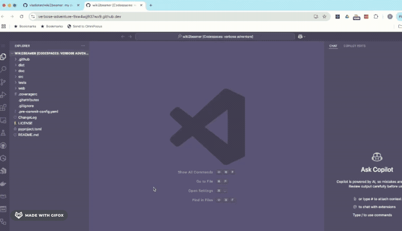
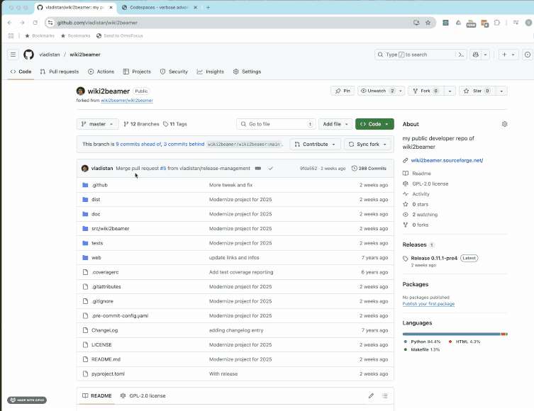

### But I don't like Browser UI it is very slow on my 64kbps connection

Web interfaces are great espescially modern ones, but you do need a fast
connection for a non painful editing experience. Also, there is a probelm with
Keyboard shortcuts as a lot of keystroke combinations are used by the browser.

There is a solution for this. You can use desktop VSCode connected to the remote connector. In this case the IDE is runnong on your local machine, but the code is being edited run on the remote machine.  In this mode the only thins that are being transferred between the local and the remote machine are the chanegs to the code and your progrram output.  

There are two ways to open a local version of VSCode connected to your Codespace. 

The first method is to open it from a running Codespace environment. To do this, press `Cmd-P` (or `Ctrl-P` on Windows) to open the command palette, then type "desktop" to find the option to open the repository in your local VSCode desktop application:

The second method is to open the Codespace directly from the GitHub repository webpage. Navigate to the repository, click on the green "Code" button, and select the "Open with

It's important to note that when you open a Codespace in your local VSCode, the remote environment is still running and consuming your Codespaces usage quota. If you exceed your free allocated minutes, you may incur charges for the additional usage.

Also, even when you are connected to a Codespace from your local VSCode, the remote environment is still subject to the idle timeout and auto-shutdown policies. If you leave your Codespace idle for an extended period, it will automatically shut down to conserve resources and prevent unnecessary charges.

To avoid unexpected costs, make sure to stop your Codespace when you are finished working. You can do this from the Codespaces page on GitHub, or by running the "Codespaces: Stop Current Codespace" command from the command palette in VSCode.

### This is nice, but the terminal in envionment seems barren,  I miss my Oh-My-Zsh

The default Codespaces setup is ready to use, but you might want to tweak it to fit your needs. You can do this by using a dotfiles repository made for Codespaces. You can create your own or use someone else's, like [this one](https://github.com/vladistan/dotfiles-codespaces).

Remember, dotfiles and Codespace settings are linked to your user profile, not the project. This means each developer can have their own customized Codespace, even if they're working on the same project. Your dotfiles will apply to your Codespace, giving you a personalized setup.

When choosing dotfiles for Codespaces, remember that it's different from a regular desktop setup. Many dotfiles on GitHub aren't made for Codespaces. To make sure everything works smoothly, find dotfiles that are specifically designed for Codespaces, like the one mentioned above. These will have the right settings to help you get started quickly with your preferred setup.

Codespaces profiles are set up in your user profile, not in the repository. This means the same configuration files, like dotfiles, will be used for all Codespaces you create. So, any changes you make to your Codespaces profile will be the same across all your projects. This is handy if you have favorite tools or settings you like to use. By setting up your profile once, you get a consistent and personalized setup every time you start a new Codespace.

Additionally, if a collaborator creates a Codespace from your repository, their own dotfiles will be applied to the Codespace. This ensures that everyone will have their workspaces customized to their personal preferences, making it easier for each team member to work in an environment they are comfortable with.

# But I don't want to give my money to M$, what are the alternatives?

If you're looking for other options besides Microsoft's Codespaces for cloud development, there are several choices. These alternatives offer different features, so you can pick the one that suits you best. 

| Environment         | Devcontainer Support | Documentation Link           | Notes                                                                                 |
|---------------------|---------------------|------------------------------|---------------------------------------------------------------------------------------|
| Coder               | Full                | [Coder Docs](https://coder.com/docs)            | Uses devcontainer.json with Terraform integration. Supports Docker, Kubernetes, and OpenShift. |
| CodeSandbox         | Partial             | [CodeSandbox Docs](https://docs.codesandbox.io/) | Supports most specs but has implementation differences (e.g., forwardPorts behavior).  |
| devenv              | Full                | [devenv Docs](https://devenv.sh/docs/devcontainer/) | Requires `devcontainer.enable = true` in config. Auto-generates `.devcontainer.json`.  |
| DevPod              | Full                | [DevPod Docs](https://devpod.sh/docs/)           | Explicitly adopts devcontainer.json, auto-detects configs, and supports multi-provider backends. |
| Daytona             | Partial*            | [GitHub](https://github.com/daytonaio/daytona)   | Provides devcontainer generator tool, but full platform support not explicitly documented. |
| Gitpod              | Full                | [Gitpod Docs](https://www.gitpod.io/docs/devcontainers) | Fully supports single/multi-container setups via devcontainer.json.                  |
| GitHub Codespaces   | Full                | [GitHub Blog](https://github.blog/2022-06-06-dev-container-support-in-github-codespaces/) | Native support with in-browser configuration editor.                                  |

### But I and my team-mates have different workspace customizations that we like
vladistan/dotfiles-codespaces: Simpler version of dotfiles for codespaces

### But I don't like giving money to M$                                
coder/coder: Provision remote development environments via Terraform
CodeSandbox: Instant Cloud Development Environments
Fast, Declarative, Reproducible, and Composable Developer Environments - devenv
loft-sh/devpod: Codespaces but open-source, client-only and unopinionated: Works with any IDE and lets you use any cloud, kubernetes or just localhost docker.
Providers | Daytona

### But I don't like VSCode
JetBrains Gateway
Can work with PyCharm
Doesn't work in CE
Support is lacking

### Use SSH trick
Can work with Cusror
Can work with Zed
Watchout
When ssh watch out for usernames
