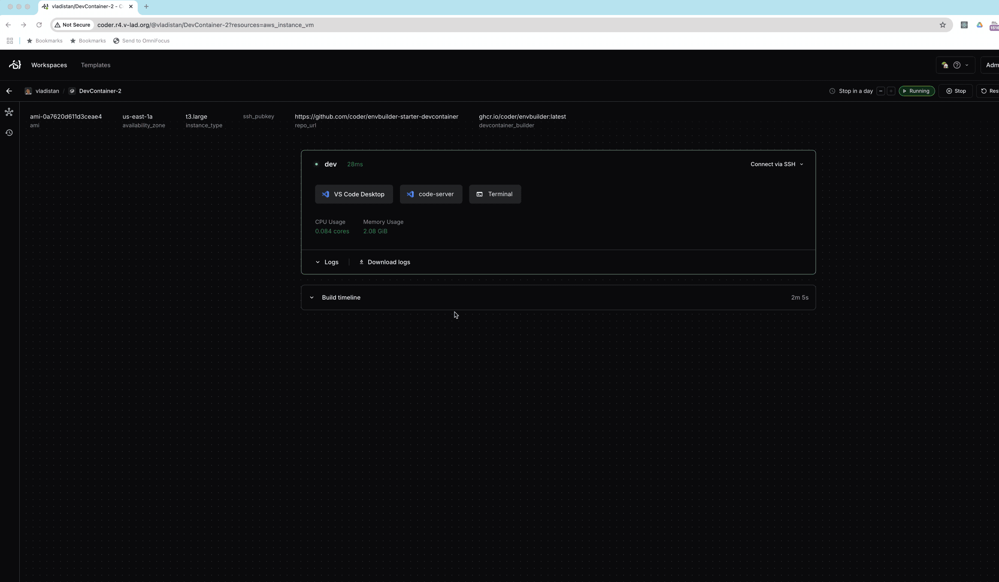

# But I Don't Like Browser UI; It Is Very Slow on My 64kbps Connection

Web interfaces are great, especially modern ones, but you do need
a fast connection for a non-painful editing experience. Also, there
is a problem with keyboard shortcuts, as a lot of keystroke
combinations are used by the browser.


There is a solution for this. You can use desktop VSCode connected
to a remote machine. In this case, the IDE is running on your
local machine, but the code is being edited and run is on the remote machine.
In this mode, the only things that are being transferred between
the local and the remote machine are the changes to the code and
your program output.

There are two ways to do this:

  1. Open it from a running Codespace environment. To do this, press
  `Cmd-P` (or `Ctrl-P` on Windows) to open the command palette,
  then type "desktop" to find the option 'Open in VSCode Desktop'.
  This command will cause your browser to start a VSCode on your
  local machine and connect it to the Codespaces environment.


  2. Open the Codespace directly from the GitHub repository webpage.
  Navigate to the repository, click on the green "Code" button, and
  select the "Open with VSCode Desktop" option.


Remember, that even if you use local VSCode to edit the code, the
remote environment is still running and consuming your Codespaces
usage quota. If you exceed your free monthly allocation of minutes,
you will be charged for the additional usage.

Also, even when you are connected to a Codespace from your local
VSCode, the remote environment is still subject to the idle timeout
and auto-shutdown policies. If you leave your Codespace idle for
an extended period, it will automatically shut down to conserve
resources and prevent unnecessary charges.

To avoid unexpected costs, make sure to stop your Codespace when
you are finished working. You can do this from the Codespaces page
on GitHub, or by running the "Codespaces: Stop Current Codespace"
command from the command palette in VSCode.

# But, I Miss Oh-My-Zsh

A typical DevContainer is configured with a basic shell setup meant
to work for everyone, unfortunately this usually means you get a
plain, minimal environment. Developers often want more like a custom
prompt, a fancy status line, better auto-completion, or extra
utilities. What feels perfect to one person might seem cluttered
or awkward to someone else, so it's tough to make a single configuration
that suits everyone. To address this,  Codespaces allows you to
use your own dotfiles.  You can set up a repository  with customizations
that make your terminal feel just right for you.

Note that your dotfiles and Codespaces settings are tied to your
GitHub user profile, not to any specific project. This means you
get your preferred setup in every Codespace, no matter which
repository you're working on.   Any changes you make to your Codespaces
profile will apply to all your Codespaces, giving you a consistent
experience with your favorite tools and settings.

If someone else starts a Codespace from your repository, their own
dotfiles will be used instead of yours. This way, each developer
gets a workspace that matches their personal preferences, making
it easier for everyone to feel comfortable and productive when
collaborating.

Keep in mind, though, that DevContainers is different from a regular
desktop environment many [dotfile
repositories](https://github.com/topics/dotfiles) found on GitHub
aren't built for DevContainers, so it's best to use ones made for
specifically for CodeSpaces like this
one](https://github.com/vladistan/dotfiles-codespaces).


# But I don't want to give my money to Microsoft, I don't use GitHub. 

If you're interested in cloud development but prefer not to use
Microsoft's products like Codespaces or GitHub, there are plenty of
alternatives available. In fact, some of these tools do not require
you to work in the cloud at all, you can run them locally or on your
own infrastructure. The DevContainers specification is an open
standard, so you can take advantage of DevContainers and similar
development environments regardless of your platform or provider.

A variety of tools now support DevContainers, each offering different
features and deployment options.  The table below shows some popular
alternatives to GitHub's Codespaces.  Some are open source, some
commercial; some can be run on your own infrastructure or local
machine, while others are hosted by vendors in the cloud.  A detailed
comparison of these tools is beyond the scope of this post, but I
plan to explore their pros and cons in the future.


| Environment         | Documentation Link           | Notes                                                                                 |
|---------------------|------------------------------|---------------------------------------------------------------------------------------|
| Coder               | [Coder Docs](https://coder.com/docs/admin/templates/managing-templates/devcontainers)            | Open source project with a paid version. You can use your own cloud provider or on premises environment. |
| DevPod              | [DevPod Docs](https://devpod.sh/docs/developing-in-workspaces/devcontainer-json)           | Desktop application, support provisioning of development environments on your local machine with docker, in your on-premises environment or in the public cloud. |
| CodeSandbox         | [CodeSandbox Docs](https://codesandbox.io/docs/tutorial/getting-started-with-dev-containers) | Commercial application, providers instant cloud development environments |
| Gitpod              | [Gitpod Docs](https://www.gitpod.io/docs/devcontainers) | Fully supports single/multi-container setups via devcontainer.json  |
| Eclipse Che         | [Eclipse Che Docs](https://www.eclipse.org/che/docs/che-7.2.0/che-user-guide/che-user-guide.html) | A project from ReadHat with heavy support for Enterprise type development.  There is an open source version you can run on your own K8s cluster |


# But I don't like VSCode

While Visual Studio Code (VSCode) is an extremely popular editor,
it's not the ideal choice for everyone. Some developers prefer
different workflows, editor ergonomics, or simply have a long-standing
preference for other environments and keyboard shortcuts. Fortunately
you are not forced to use VSCode to take full advantage of Codespaces
and DevContainers. These technologies are highly flexible, and you
can use your preferred tools to interact with cloud development
environments.


Here are a few alternatives:

## CodeSpaces Jupyter Environment


If your work is data science or notebook-centric, Codespaces offers
first-class support for Jupyter notebooks. You can open and run
`.ipynb` files directly in the browser without ever launching the
full VSCode editor interface. The Jupyter environment allows you
to leverage all the benefits of the cloud-powered Codespaces such as
persistent environments and powerful compute while sticking with a
workflow tailored to interactive Python development.


## JetBrains Gateway

If you like using JetBrains IDEs such as PyCharm, IntelliJ IDEA,
or WebStorm, you can try JetBrains Gateway. JetBrains Gateway lets
you connect your local JetBrains IDE to a remote development
environment, like a Codespace or any DevContainer you can reach
with SSH. This way, you can keep working in the JetBrains editor
you know, while all your code runs in the cloud. You still get the
same setup, tools, and containers as you would with Codespaces.


> Note: JetBrains Gateway does not currently support the free
Community Editions of the JetBrains products.  And support
for the GitHub codespaces is still in the alpha version.  

For the latest updates and community discussions regarding JetBrains
Gateway support for GitHub Codespaces, please see [this GitHub
Community discussion](https://github.com/orgs/community/discussions/78982)
and [this JetBrains YouTrack
issue](https://youtrack.jetbrains.com/issue/IJPL-177475/JetBrains-Gateway-doesnt-show-the-GitHub-Codespaces-provider).

Also, even without direct support for GitHub codespaces it is still possible to use them with JetBrains products,
look at the SSH trick below.




# I don't use VSCode, Jupyter or JetBrains can I still to collaborate with my team using my IDE?


If your IDE is not listed above,  you can still use DevContainers and Codespaces.  First, check if there is a plugin for your editor
provided by your IDE vendor or the community.  If there isn't, you can use the SSH method described below, as most editors like Zed, Cursor or Emacs these days have support for connecting to remote hosts over SSH.  Use the instructions below to set it up:


## Part 1: Setting up SSH access


1. **Install the [GitHub CLI](https://cli.github.com/):**  

  Install GitHub CLI tool using  [homebrew](https://brew.sh/) (`brew
  install gh`) or [download it
  directly](https://github.com/cli/cli/releases) from GitHub.

2. **Authenticate with GitHub:**  

  Run [`gh auth login`](https://cli.github.com/manual/gh_auth_login`)
  to sign in, or set up a [personal access
  token](https://docs.github.com/en/github/authenticating-to-github/creating-a-personal-access-token)
  and make sure its available in your environment.

3. **Create a Codespace for your repository:**  

  To create a CodeSpace for your repository,  use a command like
  the one below,  replace the repository name and machine type as
  needed.

  ```
  gh codespace create --idle-timeout 10m -R vladistan/vscode-remote-try-go -m basicLinux32gb
  ```

4. **Wait for your Codespace to become available:**  

  The Codespace may take some time to be ready. Run the following
  command repeatedly until you see its status as "available":

  ```
  gh codespace list
  ```

5. **Configure SSH for your Codespace:**  

  Once your Codespace is available, set up your SSH configuration.
  Replace `YOUR-WORKSPACE-NAME` with the actual name from the
  previous step:

  ```
  gh codespace ssh -c YOUR-WORKSPACE-NAME --config | tee -a ~/.ssh/config
  ```

See the screenshot below for an example of setting up SSH configuration for the codespace


## Part 2: Connecting your IDE to the remote DevContainer with SSH

Now that we setup SSH access to your Codespace, you can connect to
it directly from your editor.  The specific steps may differ slightly
depending on which editor you use. Below is the example that shows
the steps for  [Zed](https://zed.dev/). The process is very similar
for other IDEs.

1. **Open the command palette and start connecting to a remote server:**  

   Use the keyboard shortcut (e.g.,
   <kbd>Cmd</kbd>+<kbd>Shift</kbd>+<kbd>P</kbd> or
   <kbd>Ctrl</kbd>+<kbd>Shift</kbd>+<kbd>P</kbd>) to open the command
   palette. Then, search for "Connect to Remote" (or similar) and
   select the option to connect to a new server.

2. **Enter the SSH configuration name:**  

   When prompted, enter the full hostname from your SSH configuration
   (from the previous step), not just the codespace name.

3. **Specify the project directory:**  

   Enter the path to the directory where your project resides inside
   the codespace devcontainer.


5. **Wait for the connection:**  

   After a few seconds, your will see the remote project opened in
   your editor and ready for development.


This method works for many editors, the ones that I personally verified are:

   - [Zed](https://zed.dev/)
   - [Cursor](https://www.cursor.so/)
   - [JetBrains Gateway](https://www.jetbrains.com/remote-development/gateway/)
   - [Emacs](https://www.gnu.org/software/emacs/)
   - At the time of this writing, it does not work with [Windsurf](https://windsurf.dev/).

Few things to watch out for when using this method to connect:

   - Sometimes codespaces will fail to detect that the space is not
   idle. So, make sure to select the correct idle timeout in codespace
   settings.

   - If your codespace shuts down due to idleness or you are trying
   to reconnect to the already configured codespace that was shut
   down, use `gh codespace ssh` to connect to the codespace; it
   will be reactivated.

   - Many editors insist on specifying a username and working
   directory for the remote connection. That depends on the
   configuration of the codespace. To find out the right ones, login
   into the codespace using `gh codespace ssh` and then use `pwd`
   and `whoami` commands to find out the right values.


# Collaboration with others

When you and your teammates open Codespaces from the same repository,
everyone gets their own separate development container. Everyone
gets to work in their own space, with their own editor and terminal.
The only way to share work is by pushing and pulling changes with
Git. You do not see each other's uncommitted work or running
environments. This setup is great for independence, but it makes
real-time collaboration such as pair programming or debugging
together a bit tricky.

When closer collaboration is needed, people use screen sharing tools
like Google Meet or Slack to work together, but these can be slow,
use a lot of bandwidth, and only let one person control the screen
at a time. There is a better alternative, LiveShare. It is a feature
built right into VSCode. LiveShare allows you to invite teammates
directly into your active Codespace session. They can see your
workspace, edit files, run terminals, and debug right alongside
you, much like working together on a document in a Google Doc. Each
person can choose to either follow the host or work on different
parts of the project at the same time.

The steps below explain how to set up and use LiveShare for this kind of collaboration.


## Setting Up a LiveShare Session

### Initial Setup

- All participants need to install the **LiveShare extension**, this applies to the host and all collaborators.
- Participants decide who will be the **host** for the LiveShare session.
- LiveShare can be used with either the desktop version of VSCode or the web-based Codespaces UI.

### Host Sets Up the Session

1. The host opens the Codespace (or VSCode Desktop), clicks the **LiveShare icon**, and starts a new collaborative session.
2. Once the session begins, VSCode generates a **unique invitation link**.
3. The host copies this link and shares it with the collaborators. 

### Collaborators Join the Session

1. Collaborators wait to receive the invitation link from the host.
2. After receiving the link, each collaborator opens VSCode (desktop, web, or another Codespace), clicks the **LiveShare icon**, and selects the option to **join a collaboration session**.
3. Paste the invitation link when prompted to connect to the shared session.
4. After a brief moment, all participants will have access to the same project workspace as the host.

### Additional Notes

- The host can control each collaborator’s permissions, granting either **read-only** or **full editing** access.
- If using the desktop version, everyone’s VSCode version should match as closely as possible. Minor version differences usually do not cause issues, but significant version drift can lead to unexpected glitches.

> **Note:**  

> LiveShare sessions can be hosted either by VSCode Desktop running
on the host's machine or Codespaces environment that runs in the
cloud. Hosting your session from within a Codespace is safer, as
it restricts access to the containerized development environment
rather than your entire machine. Unfortunately, exploits are still
possible.  As with any remote collaboration tools, only invite
collaborators that you trust.


> **Caveat:**  

> LiveShare is only officially supported in the original VSCode by
Microsoft. If you're using a product based on the open source VSCode
codebasesuch as VSCodium, Windsurf, or CursorLiveShare may not
function properly or at all.  Also, LiveShare does not work with
JetBrains IDEs or Zed.


### Alternatives to LiveShare


While LiveShare is the most popular real-time collaboration feature
in Codespaces and VSCode, several other tools exist for developers
who prefer different editors or need cross-IDE collaboration:

- [**Zed**](https://zed.dev/) is designed from the ground up as a collaborative code
editor. Real-time multiplayer editing is a core part of its workflow,
making it seamless to code alongside teammates without any extra
setup.

- [**JetBrains Code With Me**](https://www.jetbrains.com/code-with-me/) is a proprietary feature available in
JetBrains IDEs (such as IntelliJ IDEA, PyCharm, and WebStorm). It
offers similar capabilities to LiveShare—shared coding, terminals,
and debugging—but is limited to JetBrains products.

- [**CodeTogether**](https://www.codetogether.com/) is an IDE-independent, commercial solution for
collaborative development. With CodeTogether, developers can join
a collaboration session from their favorite IDE—VSCode, JetBrains
IDEs, Eclipse, or even Visual Studio—and work together on the same
project. This tool enables true cross-IDE editing but requires a
monthly subscription.

