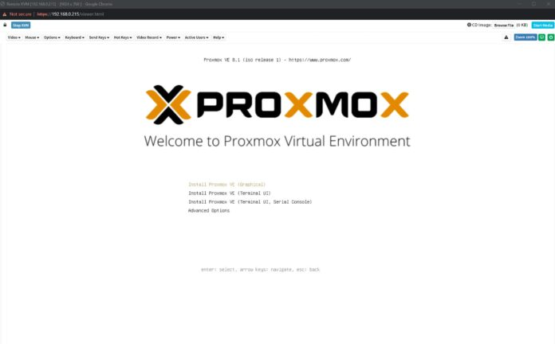

In recent years, the Python community has seen a surge in the adoption of modern development practices and tools. This movement, often referred to as "hypermodern Python," aims to enhance the quality, maintainability, and reproducibility of Python projects. At the heart of this approach lies the use of project templates that encapsulate best practices and streamline the setup process.

## Why Hypermodern Python?

Hypermodern Python emphasizes several key principles:

- Strict typing with tools like mypy for improved code reliability and readability.
- Comprehensive testing using pytest and test coverage reporting.
- Consistent formatting enforced by black and isort.
- Linting with flake8 to catch potential issues early.
- Continuous integration and deployment (CI/CD) pipelines for automated testing and release management.
- Containerization using Docker for reproducible development and deployment environments.
- Documentation generation with tools like Sphinx and MkDocs.

By adhering to these principles, Python projects become more robust, maintainable, and collaborative.

## Essential Tools

To embrace the hypermodern Python approach, several tools have become essential:

- Poetry: A modern dependency management and packaging tool that simplifies project setup and dependency resolution.
- pre-commit: A framework for managing and executing pre-commit hooks, ensuring consistent code style and catching issues before committing.
- nox: A flexible test automation tool that allows running tests and other tasks in isolated environments.
- GitHub Actions or GitLab CI: Popular CI/CD platforms that enable automated testing, linting, and deployment pipelines.

These tools work together to create a seamless development workflow and promote best practices throughout the project lifecycle.

## Library vs Application Templates

When it comes to project templates, there are two main categories: library templates and application templates.

Library templates are designed for creating reusable Python packages that can be published to package repositories like PyPI. They focus on proper package structure, documentation, and distribution setup.

Application templates, on the other hand, are geared towards building standalone applications or microservices. They often include additional features like command-line interfaces, configuration management, and containerization.

## Popular Hypermodern Python Templates

Several popular project templates have emerged to jumpstart hypermodern Python projects:

### 1. Git Clone

One approach is to create a reference project that embodies hypermodern practices and use it as a template. Developers can simply clone the repository, remove the Git history, and start building their project on top of the template.

### 2. Cookiecutter

Cookiecutter is a popular tool for creating projects from templates. It prompts the user for project-specific information and generates a customized project structure based on the template. Many hypermodern Python templates are available as Cookiecutter templates.

### 3. Copier

Copier is another project templating tool that offers more flexibility and customization options compared to Cookiecutter. It allows for dynamic template generation and supports updating an existing project based on the template. Copier templates are becoming increasingly popular in the hypermodern Python community.


## Template Reviews


When evaluating hypermodern Python templates, it's important to keep in mind that all templates are opinionated. This can be both advantageous and disadvantageous, depending on your specific needs and preferences.

To get started with any of these templates, you'll need to have a few prerequisites installed at a minimum:

1. **Pyenv**: A Python version management tool that allows you to easily switch between different Python versions.
2. **Poetry**: A modern dependency management and packaging tool for Python projects.
3. **Pre-commit**: A framework for managing and executing pre-commit hooks to ensure code quality and consistency.
4. **Pipx** (highly recommended): A tool for installing and running Python applications in isolated environments.

While not strictly required, Pipx is highly recommended as it provides a clean and convenient way to manage Python tools and applications.

It's worth noting that some templates may have additional prerequisites or setup steps, which will be discussed in their respective sections.


| Template                | Last Commit | Stars | Contributors | Description                              |
|-------------------------|-------------|-------|--------------|------------------------------------------|
| [Tyrannosaurus](#tyrannosaurus)           | 7/23        | 93    | 6            | Requires pre-commit                      |
| [Cookie-Hyper-Modern](#cookie-hyper-modern)    | 7/23        | 2k    | 18           | Comprehensive template                   |
| [Cookiecutter PyPackage](#cookiecutter-pypackage) | 4/24        | 4k    | 122          | Popular cookiecutter template            |
| [Ionelmc Cookiecutter PyLibrary](#ionelmc-cookiecutter-pylibrary) | 6/23        | 1.2k  | 43           | Requires jinja2mod                       |
| [Proinsas Copier Project](#proinsas-copier-project) | 6/24        | 3     | 1            | Copier-based template                    |
| [Calcipy Template](#calcipy-template)        | 7/24        | 1     | 1            | Calcify template                         |
| [Serious Scaffold](#serious-scaffold)        | 7/24        | 68    | 6            | Comprehensive template                   |
| [Link Template](#link-template)           | 6/24        | 58    | 15           | Lincc frameworks template                |
| [Brownie Broke](#brownie-broke)           | 7/24        | 53    | 9            | Django template, sets up GitHub repo     |
| [Jaraco Skeleton](#jaraco-skeleton)         | 7/24        | 118   | 119          | Simple clone template                    |
| [Astrojuanlu Copier PyLib](#astrojuanlu-copier-pylib) | 7/24        | 9     | 3            | Library-focused template                 |
| [Lukin0110 Poetry Copier](#lukin0110-poetry-copier) | 4/24        | 8     | 1            | Supports various project types           |
| [JohTHagen Python Blueprint](#johthagen-python-blueprint) | 7/23        | 561   | 4            | Simple clone template                    |

### Tyrannosaurus

1. Uses own tool tyrannosaurus to create new projects, this tool is a bit dated,  but according to author is undergoing massive rehaul

- [GitHub Repository](https://github.com/dmyersturnbull/tyrannosaurus?tab=readme-ov-file)

2. Keeps everything in project.toml automatically sync to other files.

3. Does not setup local git repo
4. Does not configure Github repo


- Setup instructions:
  ```
  pipx install tyrannosaurus
  tyrannosaurus new hypermod-test --track
  git init .
  git add .
  git commit -m "initial commit"
  ```

The Tyrannosaurus template is an interesting project, but it has some drawbacks that make it not recommended for immediate use:

- The templating tool itself (tyrannosaurus) is somewhat outdated. The author acknowledges this and mentions that it is undergoing a massive rehaul, but the current version may have issues.

- The template doesn't run out of the box and requires some tweaking to get it working properly. This could be frustrating for users expecting a smooth setup experience.

Despite these issues, the Tyrannosaurus template has a lot of interesting features and design choices that are worth studying:

- It keeps all configuration in a central `project.toml` file and automatically syncs changes to other files. This is a nice way to maintain consistency across the project.

- It includes a variety of useful tools preconfigured

Overall, while not recommended for direct use due to its current state, the Tyrannosaurus template is a valuable source of recipes and practices for structuring Python projects using modern tooling. Developers can learn from its approach and potentially adapt some of its ideas into their own projects or templates.


Tools

   - Docker
   - 


TODO: 
  - How does it auto configure pre-commit
  - Need to sync before pre-com

### Cookie-Hyper-Modern

- Comprehensive hypermodern Python template
- [GitHub Repository](https://github.com/cjolowicz/cookiecutter-hypermodern-python?tab=readme-ov-file)

- Uses cookiecutter
- Embeds pre-comimt and hooks into pyproject.toml
- Doesn't setup local git repo
- Doesn't configure virtualenv
- Needs a readme with steps how to get it going
- Uses darglint which is no longer maintained
- Uses locally installed pre-commit tools
- Installs linters as dev dependencies$$

Final verdict,  useseable out of the box with minimal fuss.
Some tools are no longer maintained, but still works in 2024
Nice choice.  Extra thumbs up for using Nox

TODO: 
   - Give a try
   - Look into labeler
   - Look into version bumper


### Cookiecutter PyPackage

- Popular cookiecutter template for Python packages
- [GitHub Repository](https://github.com/audreyfeldroy/cookiecutter-pypackage)

- Readme doesn't explain how to set it up for dev
- Does not use poetry
- A lot of stars and forks
- Very minimalistic template
- Uses setuptools
- No poetry, pre-commit etc


- Travis


### Ionelmc Cookiecutter PyLibrary

- Requires jinja2mod installation
- [GitHub Repository](https://github.com/ionelmc/cookiecutter-pylibrary)
- Lots of stars
- Made specifically for libraries
- Rich github and gitlab support
- Supports tbump and bumpversion
- Multiple native extension support
- Extensive tool support [codeclimate, codacy, coveralls, etc]
- Initializes GIt repo
- Matrix strategy testing
- Doesn't use poetry
  
Overall, nice template made specifically for libraries. 
If you are ok without poetry this is a great choice. 

TODO: 
  - Give a try


### Proinsas Copier Project

- Copier-based Python project template
- [GitHub Repository](https://github.com/proinsias/copier-python-template?tab=readme-ov-file)

 - Not in the spotlight, no stars
 - Good setup instructions
 - Good github support
 - Little bias towards data science projects
 - Extensive pre-commit config
 - pre-commit overly heavy takes a while to run
  
Overall mega starter kitchensink template, not recommended as
as default project template, but an excellent source of
recipes and ideas.

TODO: Give a try
Used by PDF-Splitter


### Calcipy Template

- Template for the Calcipy project
- [GitHub Repository](https://github.com/KyleKing/calcipy_template/)

 - Not in the spotlight, no stars
 - Good setup instructions
 - Good github support
 - Some github repo creation support
 - Doesn't initialize / configure local git repo
 - Points for nox
 - Docs based on mkdocs
 - Good mix of modern tools
 - Comitizen is somewhat annoying
 - 

Promotes own tool [calcipy](https://github.com/KyleKing/calcipy)
Uses readme in docs directory

Doesn't use src/proj convention
Version is in multiple places
Tags workflow is weird
Weird with multi word module name like txtgen-loader-gmail confuses dash and underscore


TODO: Give a try

### Serious Scaffold

- Comprehensive Python project template
- [GitHub Repository](https://github.com/serious-scaffold/ss-python)

- Doesn't setup local git repo
- Rich pre-commit [checkout, post merge, etc]
- dev containers
- renovate
- changelog
- devcontainers
- semantic release
- matrix builds
- docker
- vscode settings
- renovate
- pdm

TODO: Give a try

### Link Template

- Python project template by Lincc Frameworks
- [GitHub Repository](https://github.com/lincc-frameworks/python-project-template/tree/main)

- Notebooks
- Ligthweight setup
- Multiple Python versions
- *BENCHMARKING*
- No automatic github setup,  but good checklist
- No poetry bare-bones
- Virtual env based
- Doesn't use pyenv for venv
- pre-commit doesn't work out of the box (hard codes python version, make sure it matches)
- Smoke test that run periodically notify when dependencies are broken even if there is no activity on the repo
- Matrix python build


   Nice lightweight template,  will not work for everybody due to
   opinionated choices, but if it works for you it's a great choice


### Brownie Broke

- Django-focused template
- Sets up GitHub repository
- Requires NPX
- [GitHub Repository](https://github.com/browniebroke/pypackage-template)

 - Has defaults for JetBrains


### Jaraco Skeleton

- Simple clone template
- [Blog Post](https://blog.jaraco.com/skeleton/)

- Simple git clone no tooling needed
- Simple pre-commit
- Merge queues
- Test matrix
- Heavy tox usage

Simple template, no tooling needed.  

### Astrojuanlu Copier PyLib

- Library-focused template using Copier
- [GitHub Repository](https://github.com/astrojuanlu/copier-pylib)

- Another lightweight template
- GitHub support
- PDM


### Lukin0110 Poetry Copier

- Supports various project types (FastAPI app, Package, Gradio mod, Django, Pydantic, Streamlit)
- Optional Makefile
- Supports GitHub and GitLab
- Private repository support
- [GitHub Repository](https://github.com/lukin0110/poetry-copier)

- VSCode settings
- Pydantic
- GitLab / GitHub
- Private PIP repos
- Docker
- .python-version
- Poetry
- Needs mypy globally installed
- Also needs pydantic-mypy
- Good choice of pre-commit tools
- DevContainer
- Poe the poet
- Devcontainer
- Very old poetry version
- Heavy reliance on Docker
  
Great choice if you like dev containers.  Some tools a bit
outdated


### JohTHagen Python Blueprint

- Simple clone template
- [GitHub Repository](https://github.com/johnthagen/python-blueprint/issues)

 - Mkdocs and Github pages
 - Poetry
 - Nox
 - Setup instructions for PyCharm
  
  Overall nice minimalistic template, but with good choice of
  tools.  Great for getting started and then adding missing
  pieces from other templates described here.


# Ned

- The most minimalistic template
- https://github.com/nedbat/pkgsample

Bare minimum template. 

# Edx


## Conclusion

Adopting hypermodern Python practices and using well-crafted project templates can significantly improve the quality and maintainability of Python projects. By leveraging tools like Poetry, pre-commit, and nox, along with popular templating solutions like Cookiecutter and Copier, developers can kickstart their projects with a solid foundation and focus on writing great code.

