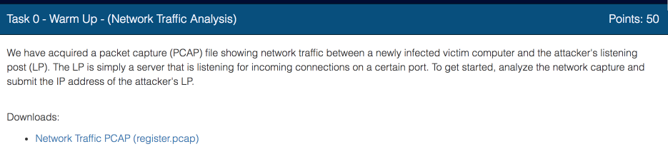
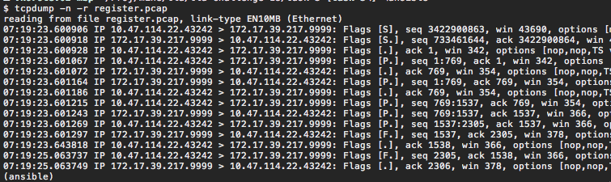
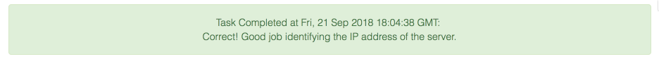

This task is really simple,  all you need to do is download given capture file and analyze it with a tool like [tcpdump](https://www.tcpdump.org/) or [WireShark](https://www.wireshark.org/)

Let's use tcpdump.  

The PCAP file given to us contains a dump of a single conversation. Between two hosts first with the IP address  10.47.114.22 and the second with the IP address 172.17.39.217.  We also see that host 10.47.114.22 sends out the first packet and it has a higher port number than the host 172.17.39.217.  So we can guess that this is a typical client server design where Ransomware reaches out to the control host first.  So we make a guess that the address of command server is *172.17.39.217*

So, let's try.

Yes our guess was right.

Next let's do [Task 2](../codebreaker2018_task2/)
