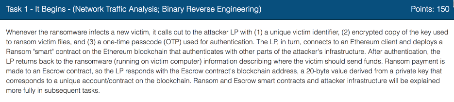

In this task we are asked to examine the binary pieces left by ransomware and captured network traffic to extract the following information:

  * Victim Identifier
  * Encrypted Ransom Key
  * One-Time Passcode (OTP) used to authenticate the client to the ransomware LP
  * Escrow contract address

There are two ways to do this:
  *	we can just extract this information from the dump using some guesswork and a bit of luck, or;
  *	we can go the full reverse engineering route.

The second option is a fast one, but we will then run into problems during the following tasks, so we have to reverse engineer everything anyway.

Let’s do it the right way the first time.

We are given two binary shared libraries that are pieces of a larger program. The challenge states that the rest of the ransomware has been removed by the attackers after the infection.

We will solve the problem by building the model that incorporates the reverse engineered code from the libraries, the unit tests that exercise the code under different conditions and some mock up code to simulate the attackers’ infrastructure.

The mock-up code is very important for several reasons. Firstly, the ransomware is a client-server type of system for which we have only the client. We don’t have any control over the server part, nor should we communicate with the attackers while trying to develop countermeasures against them. Secondly, even if we had access to a ransomware server, we still would use the mocks because the distributed network development is very hard. It’s much easier to work on something that is self-contained within a single process that we have complete control over.

We will use a standard mock pattern by following these steps:

1. Prepare canned responses to the ransomware code
* Reset the mock to initial state
* Call ransomware function under tests
   * Mocks check that they were called with the expected parameters and return the canned response back.
* We'll assert that mocks we called correct number of times in correct sequence with correct parameters
* We'll also assert that function under test returned expected result

You can read more about mocking [here](http://bit.ly/2FsnvOv).  We will use a [cpputest](http://bit.ly/2M7S0dP) library which includes both great unit testing and mocking package.

## Let's begin.

First we setup our [initial model](http://bit.ly/2smEg60).  This model is just a skeleton framework with some rudimentary tests, and then we will expand it later in the process.

Then we'll use wireshark to dump the conversation between the ransomware and command post into the form of C arrays.  This is very handy to use in our model code.

1. Open provided traffic capture with [wireshark](http://bit.ly/2FpNNBc)

* Right click (on mac CMD-Click) the first packet and select "Follow TCP Stream" 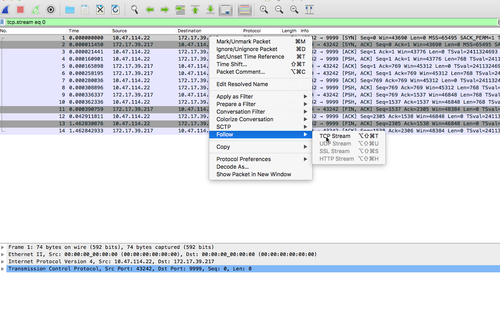

* Once you see the conversation dump, select show as C arrays and save the file into the model code.  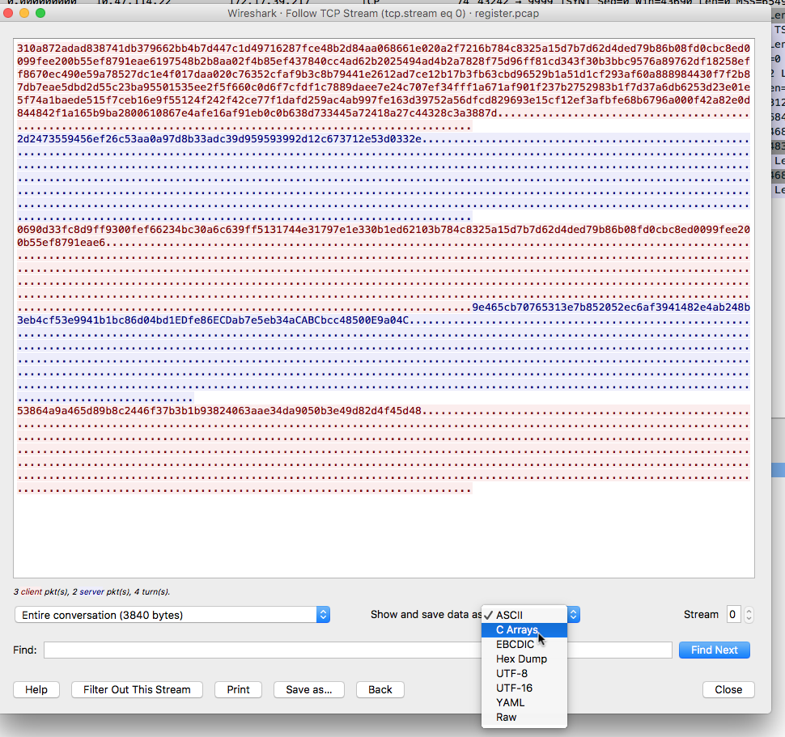

* Include saved file [into the model](http://bit.ly/2D4iEld)

Now that we have test data, let's take a crack at lib\_comm.so. We will use a combination of [Dissasembler.io](http://bit.ly/2Fpufwz) and [Radare](http://bit.ly/2sgwURE). If you haven't done [Task 2](../codebreaker2018_task2/) yet, I strongly recommend completing that task first, before doing this one.

We start by having a look at the code with Dissasembler.io. 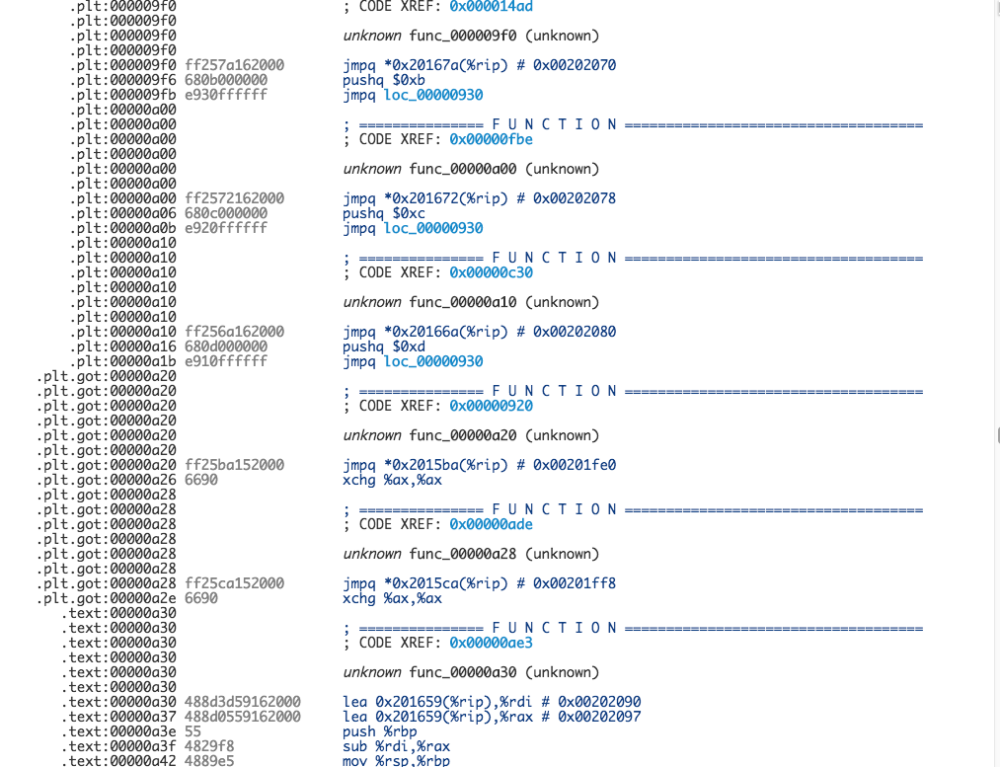

Most functions in the library are just shims that glue dynamic libraries together.
Except for the three at the bottom that seem to do something useful.
Unfortunately, disassembler.io doesn’t do a very good job at resolving external references.
This makes it quite hard to understand what is going on. Perhaps Radare will be more effective.

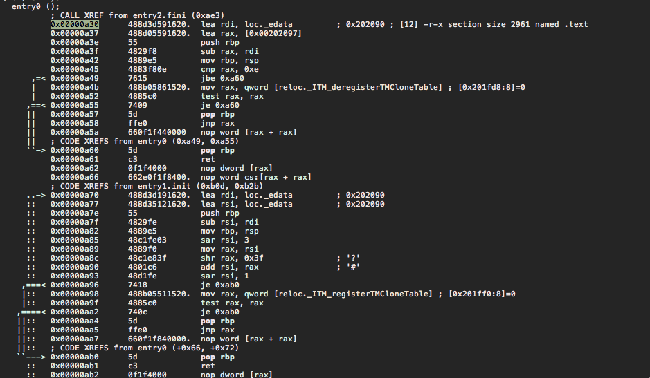.

Yes, this looks much better. Now we do see the actual mentioning of external names.
The function at *0xa30* is just a standard DLL shutdown / clean-up function, and can be ignored for now.

Let's look at the one at *0xb30* 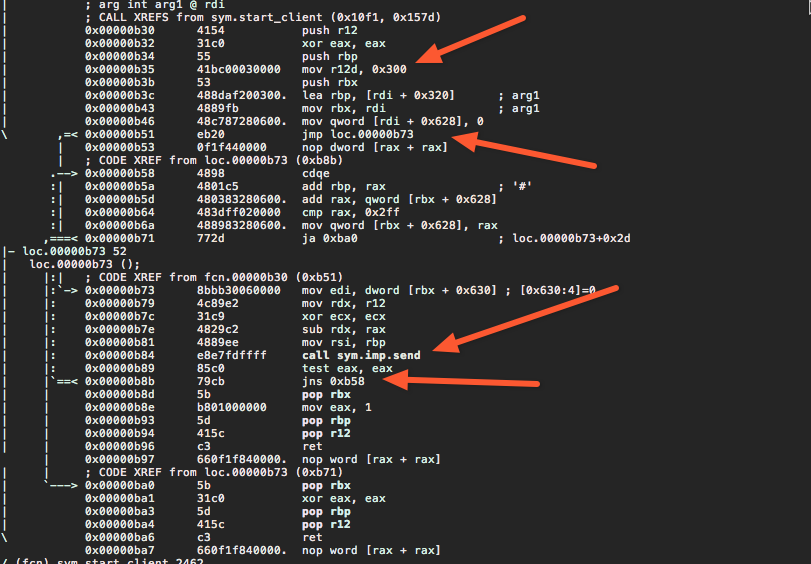

Although disassembler.io was not that helpful with the external names, it is very effective when much better with analyzing the structure of the code.

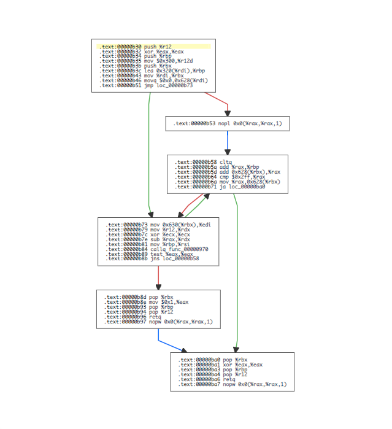

Looks like a function that tries to send a fixed size buffer while handling the case of partial transmissions due to full buffers on the local host.

What else can we learn from it?

  1. We confirm that our block size is 0x300
  2. We also see that they are trying to be Object Oriented and pass around an object of 0x790 bytes long, that includes 0x300 size buffer.
  3. Also we see that the buffer starts at position 0x320

Let's copy these facts to our model.  [Here](http://bit.ly/2Foc4Zb) is our reverse engineered transmit function.

## Now let's take a look at at the next function.

Again the structure dump from disassembler.io comes in handy

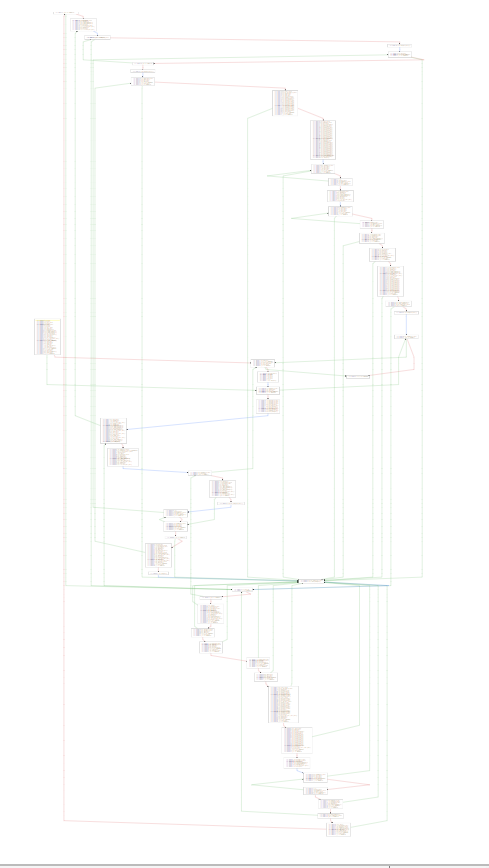

as well as the analysis done by the Radare2.  

An ugly set of parameters

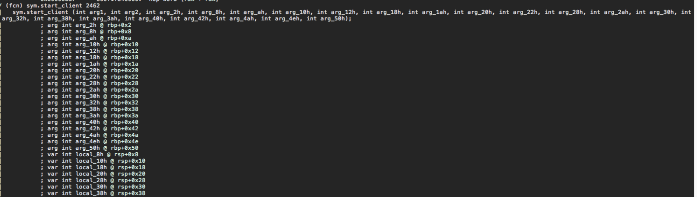

However, it doesn't look that bad

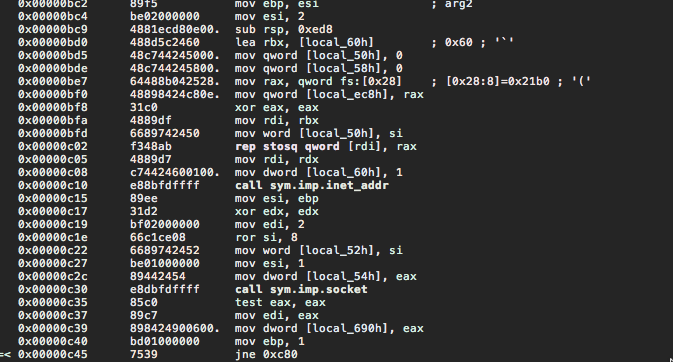

Mostly just a bunch of data shuffling back and forth

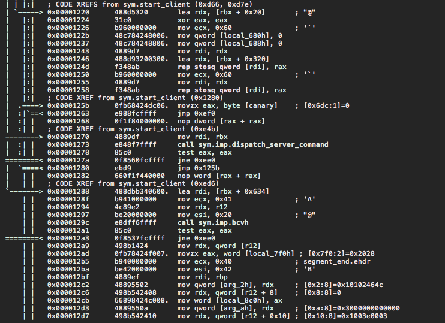

Let's rewrite those back in C.  We see lots of calls being made to *libclient_crypt.so* routines. For now, we'll just hardcode their responses using the information we got from the wireshark dump.

But, we'll make one exception with regard to the above. Let's look at what the BCVH function might be doing. Looks like it just converts binary values to hex strings. We can just write one like this without resorting to reverse engineering tricks.

[Here](http://bit.ly/2FrI2Tm) is the result of our efforts so far.

These are all the functions that seem interesting in the *libclient_comm.so*

## Let's look at the crypto library

First let's take a look at the functions. 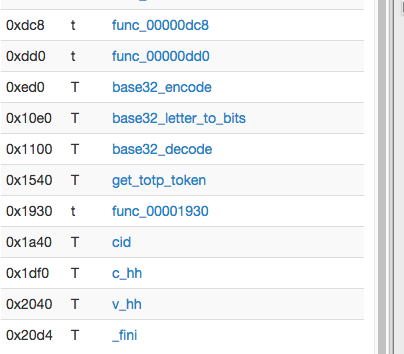

Some of those like base32 decode/encode we can just write ourselves, this is faster than digging through reverse engineering. The V_hh function looks like some kind of authentication function. Since we know that this is a successful exchange between ransomware and the server we’ll just stub it. It doesn’t look relevant to our task anyway.

We'll use [RFC-4648](http://bit.ly/2SLbYOd) for the spec of base32 encoding.

So [here](http://bit.ly/2THikhC) is what we got so far.

Now we've got all basic functions. Let's see if we can compute the packet signatures that we have had hardcoded.

Let's see what Radare shows.

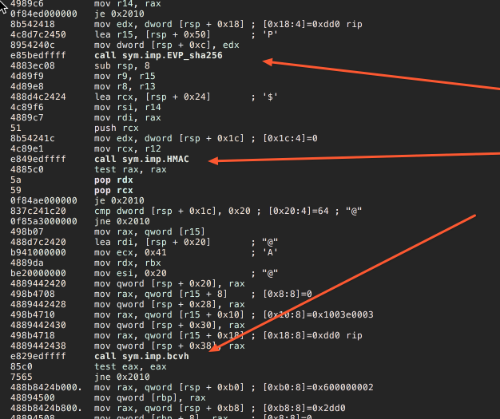

Looks like c_hh is just straightforward HMAC setup using SHA256 follow with the call to BCVH for which we already have a source code.  Let's code it up and see if it works.

[Here](http://bit.ly/2smRfEH) is the implementation of the real checksum function and the rest of the protocol.

Now we understand completely what the protocol is between client and the server. It looks like this 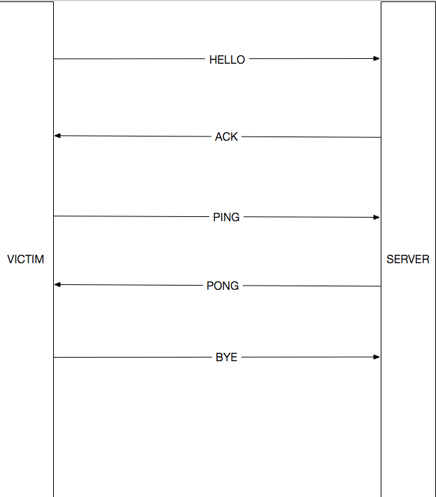

Here is our assumption of the meaning of each message:

  * `HELLO` - initial message to the server,  include victim IP address, victim ID,  OTP and Encrypted Ransom Key. The message is signed with Ransomware secret key using HMAC/SHA256 protocol
  * `ACK` - server responds with an ACK of some sort
  * `PING` - Ransomware again sends a message to the server, this time it's just a signed victim_ip and victim_id signed using the same method
  * `PONG` - server responds with an ACK of some sort
  * `BYE` - finally ransomware sends the final message which is just a signature of the last ACK received from the server

*NOTE* The names of these messages are made up by me.  As typical in reverse engineering scenarios we don't know the actual names of the variables and constants used by original programmers.  This could be viewed as both a good and a bad thing.  Having looked at a considerable amount of bad source code, sometimes bad source code is worse than not having a source code at all.  The combination of modern optimizing compilers that clean up and remove redundancies, and streamline code and modern reverse engineering tools that show graphs of basic blogs like the ones shown above, give a lot of insight into the internal functioning of the software.  

The protocol looks pretty naive and convoluted, probably the attackers are trying to guard against replay attacks and substituted malware code.

Now that we have a complete reverse engineered model of the ransomware [code](http://bit.ly/2AGXTu1) we can take a look at the code that prepares the HELLO packet.  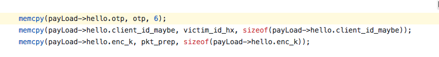

the structure of client `HELLO` packet

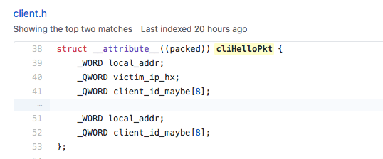

and these unit tests

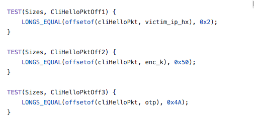

as well as the ransom note

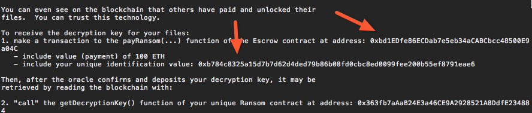

and a dump of the hello packet

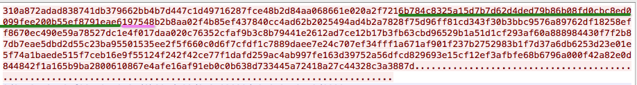

and we have all the information we need

* Escrow contract address - has been given to us in the ransom note left by the attacker
* Victim Identifier - has been given in the ransom note,  we can also see it in the dump of the hello packet
* One-Time Passcode (OTP) - in the dump of the hello packet, the 6 symbols that immediately follow the victim identifier
* Encrypted Ransom Key - again in the dump of the hello packet. It's the rest of the data after OTP

Note on the encoding.  The encoding of the messages is little bit weird.  Looks like they convert all binary values to their hex representation,  except for the OTP which is converted to decimal.  Not clear what the attackers trying to accomplish here.  Perhaps the command server is written in the language that is not very friendly to binary encoding. (Javascript?)

Now that we have all the data,  we can submit it to the challenge.

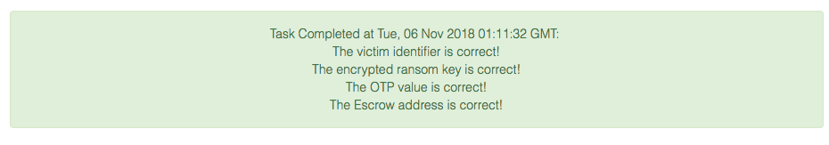

## Additional reading materials

1. We have relied a lot on test driven development (TDD) techniques.  It was not a pure TDD, because that we already had a code. But a lot of practices came from the TDD approach.  Kent Becks' [Test Driven Development](https://amzn.to/2M7RSuS) and Roy Osherove [The Art of Unit Testing](https://amzn.to/2SPqHYx) are great introductions to these techniques

2. To learn more about Mocks, read Martin Fowler's article [Mocks Arent' Stubs](http://bit.ly/2FsnvOv)

3. Most of the TDD material out there usually talks about projects written in languages like Java / Python / Ruby / Javascript.  The James Grenning's [Test Driven Development for Embedded C](https://amzn.to/2RFiBV7) describes a lot of techniques we have used to solve this task

4. The best way to learn TDD is to practice it.  And the best way to practice it is with the group of people.  Checkout these meetups are in your neighborhood:

   * [New York](http://bit.ly/2Rm5RDj)
   * [Baltimore](http://bit.ly/2VNQh1L)
   * [Austin](http://bit.ly/2FpYZOW)
   * [Boston](http://bit.ly/2soL5nI)
   * [Washington,DC](http://bit.ly/2QGDOZX)
   * [Global Day of Code Retreat](http://bit.ly/2slH1oa) -- annual event happens around November.

Let's continue to [Task 3](../codebreaker2018_task3)
