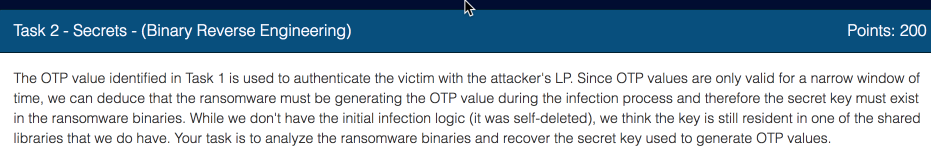
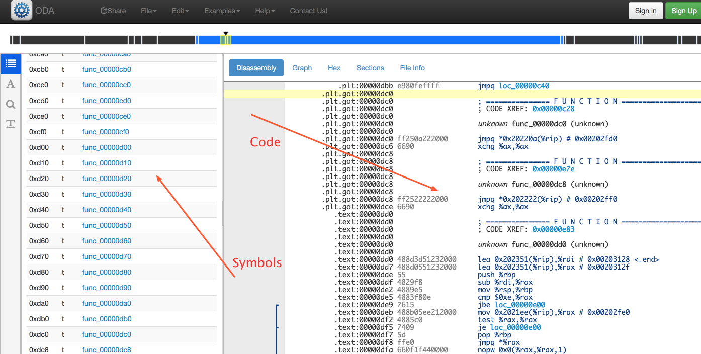
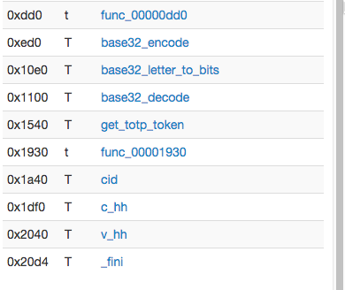
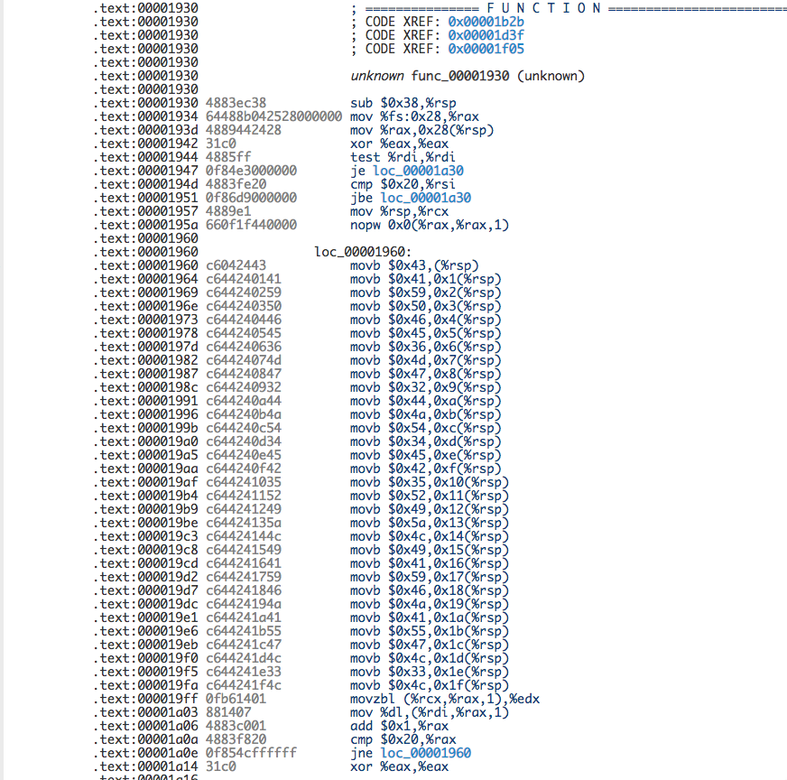
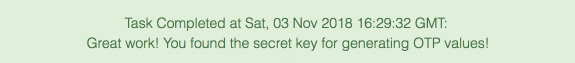

Let's look at Task 2 before doing Task 1.  It's much quicker and easier task, and it will give us some warm up practice in reverse engineering before we dive into much more involved Task 1.



In this task we are asked to extract secret key from the binaries left over by the ransomware.  To solve this we need to use some reverse engineering tools.

The organizers of recommend [IDAPro](http://bit.ly/2ST8vgN) or [Binary Ninja](http://bit.ly/2FgVYAk).  IDAPro is indeed an excellent tool, unfortunately to get the full functionality you have to buy a the full version which is quite pricey.  I never used the Binary Ninja,  looks like a good tool, but also costs some money.

To keep this open to widest number of people I opted for the Free tools.  The [Dissasembler.io](http://bit.ly/2Fpufwz) and [Radare](http://bit.ly/2sgwURE)

First one is a web application,  you don't need anything to install,  second one is an open source tool which is package with many distributions.  For example on Mac you can use excellent [Homebrew](http://bit.ly/2D2iVFf) package manager to install it.

```
brew install radare2
```

Radare will come handy for the Task 1.  In this task we'll stick with [Dissasembler.io](http://bit.ly/2Fpufwz).  

Ok, let's go.

1. Download libclient_crypt.so
* Open [Dissasembler.io](http://bit.ly/2Fpufwz) in your browser
* Click on start disassembling button that looks like this 
* Once the app loads, upload your *libclient_crypt.so* file.
* After a short time you file will be disassembled and you'll see the  screen like this 
  with the symbols pane on the left and code pane on the right.  
* Scroll symbols pane all the way down 
* Most functions names are self explanatory, except for the one that just called *func_00001930*, this looks suspicious. Click on it's name to see the code 
* These *MOVB* instructions look interesting. Looks like this function is writing a sequence of byte values to a memory location.
* So what's can we say about these bytes?  We see that they values range between 0x30 and 0x59.  Which covers digits 0 and uppercase letters.
* Let's refresh our memory about Base32 encoding [here](http://bit.ly/2TF6sN3) and [here](http://bit.ly/2SQ5Fcc).
* We see that's most common form of Base32 encoding uses uppercase letters A-Z and numbers 0-9.
* So, most likely this is what we want.
* Let's convert this hex values to their ASCII representation to get the string *CAYPFE6MG2DJT4EB5RIZLIAYFJAUGL3L*
* Let's submit it to the challenge
* Voila! 

## Additional reading materials

If you want to find out more about the way we identified our suspect function so quick.
Check out these reading materials.

* Very comprehensive series of posts about linkers and shared libraries [https://www.airs.com/blog/page/4?s=linkers](http://bit.ly/2D3nLBS)
* [Linkers and loader](https://amzn.to/2VHxBkq) by John R. Levin -- very comprehensive overview of linkers, loaders and shared libraries.  Somewhat dated, but things haven't changed that much since 2000
