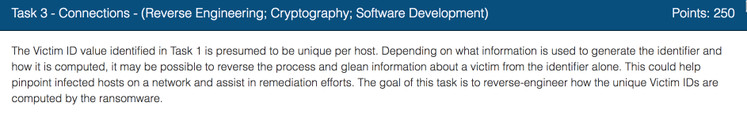
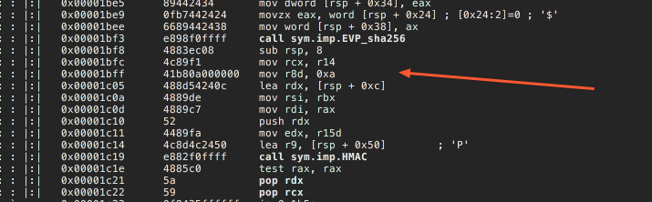
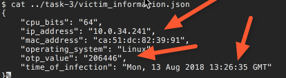
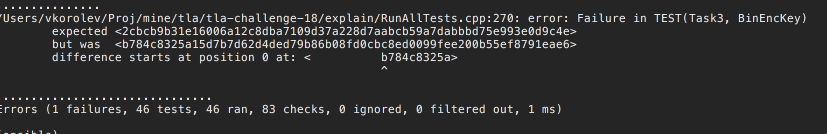

While solving [Task 1](../codebreaker2018_task1), we didn't reverse engineer the CID function.  Now, this is the time to do so.

Again, we'll use Radare.

Looks like it uses `epochtime`, and then call unnamed function.  Most likely that's OTP calculation.

Aha, looks like it is SHA256 HMAC signature calculation.  It uses the same secret key that we recovered in [Task 2](../codebreaker2018_task2)

`cid = HMAC( 'IP_ADDR | OTP')`

The full implementation of the function with the tests is [here](http://bit.ly/2H8TrtR).
Note that in our test cases we used IP address and the OTP values that we recovered in [Task 0](../codebreaker2018_task0) and [Task 1](../codebreaker2018_task1).

All we need now is too look at the `victim_information` file to get the new values for `ip address` and `OTP`.

Then enter them as the input of the test case. [Here](http://bit.ly/2D5FJUp) is the example.

Let's run the model again with the new values.

Test case is failing,  but look we now have the new CID value for the other victim. We can submit it now.

Now lets move on to [Task 4](../codebreaker2018_task4)
