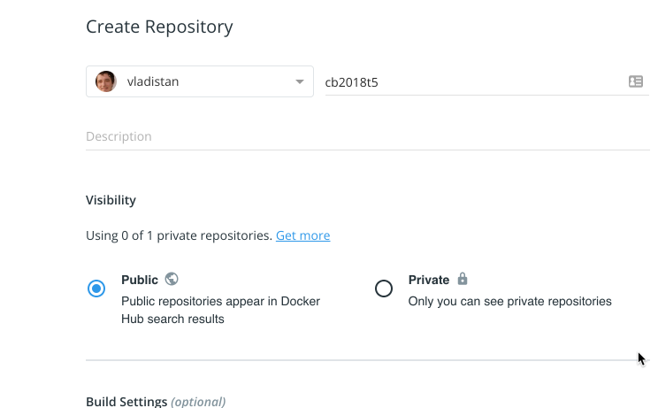

In this task we are asked to find out which hosts were infected on our network given the victim ids we have discovered in [Task 4](../codebreaker2018_task4).

What do we know so far:

  * We have a list of all VictimIDs
  * We can generate correct VictimID given IP address and OTP
  * We know IP range for our network is 10.47.0.0/16   (2^16)
  * We know that OTPs are 6 digit numbers (roughly 2^20)

Given the above we are looking at the problem space with the size of 2^16 * 2^20.  This is roughly 10^10 tries.  In these days of cloud computing, multi-core CPUs seems pretty feasible to brute force.  Looks like 100 something core cluster will be able to to crack this in a few minutes.

## Configure CI server

These days when faced with this type of tasks I use continuous integration (CI) servers.  My favorite one is [Go.CD](http://bit.ly/2TNA6je), unfortunately a particular feature that we'll need to solve this task cheaply and efficiently is only available in the enterprise version. So, we will go with [Jenkins](http://bit.ly/2TQ3Pbd).


To solve this task I launched a brand new Jenkins server using standard configuration.  After initial setup we need to install the following plugins:

  - Amazon EC2
  - GitHub API
  - Job DSL
  - Chucknorris
  - Github
  - Matrix Project
  - Matrix Reloaded
  - Timestamper

The only Jenkins job that we will create by hand is the seed job, which will bring up the rest of the jobs.

To create seed job first click the 'New Item' link on the main page of Jenkins.  

 

Then select *Freestyle Project* as the project type.  On the configuration screen select the checkbox *Github Project* and enter [https://github.com/vladistan/codebreaker-2018-jenkins-seed/](http://bit.ly/2MbtTer) for *Github Project URL*.  Also, enter [https://github.com/vladistan/codebreaker-2018-jenkins-seed.git](http://bit.ly/2MbtTer) as git repository URL.  Make sure to pay attention to both URLs they look the same,  but the last one ends with *.git*  


In the build triggers configure it to *Poll SCM* and enter `H/2 * * * *` as the schedule.  With this schedule string Jenkins server will poll the GitHub seed-job repository every two minutes,  when detects the changes it will apply them to existing jobs right away.


Scroll down to *Build* section and click on *Add Build Step* button, when pop-up appears select *Process Job DSLs*


Configure DSL build step to look for the job definitions on the file sytem, and enter `**/*.groovy` as the DSL script filename pattern.


Finally save the job.  Once you do it Jenkins server will start polling GitHub and create jobs define in the scripts placed in the repository.

After a few minutes you should a see a new job called `vlad-task-5` appearing on the Jenkins main screen.  Running this job will give you solution to the Task-5, but for my personal set of input.  Let's examine this job in details and see how to customize it for different set of inputs.


## Brute force ID cracking job

We will use the following method to find IP addresses by brute force

  - We will add a few routine to the model that will use the CID routine to generate series of CIDs for given range of IP addresses and OTP values.  Also we will add functions to see if these newly generated CIDs match any of the known CIDs.  Finally we will add functions that generate individual IP addresses and OTP values given the range.

  - We will create a cracking program that given the IP subrange will try all possible addresses and OTP values in that subrange to see if any CIDs generated using these match CIDs known by us.

  - We will put this program into a Docker container

  - We will use Jenkins server to the container against every possible subrange within the range of IP addresses given to us.  We will use [Matrix Project plugin](http://bit.ly/2D9nY6F)  for that.

  - Jenkins server will create a number of temporary EC2 instances necessary to run the cracking program.  Jenkins will take care of spinning up the instances when there jobs to run and will shut them down when they are no longer needed. For that we will use [Amazon EC2 plugin](http://bit.ly/2MeeoCI).

  - That cracking program will be set up in such a way that it will indicate a failure when it finds matching CID. If it doesn't find any matching CIDs in the given range it will finish successfully.  Doing it this way makes it easier to spot the runs we are interested in.

[Here](http://bit.ly/2M8GOha) is the modified model with all functions, tests, and an instance of cracking program

Since cracking program takes some time to run and go over all possible OTP values and networking addresses we need to divide our search space into smaller manageable chunks.  From `network_information.txt` we see that we need to cover /16 size network.  Which means that first two octets of the IP address always remain the same and two other vary between 0 to 255. We will break down our runs to probe a single value of 3rd octet and 16 possible values in the 4th octet.  This way we'll need to have about 4000 runs of our program or more precisely 16 * 256

Let's test it using the IP address that we already know, namely the one we found in [Task 0](../codebreaker2018_task0) 10.47.114.22.  This address lies in the search segment 114  1.  First number is just a third octet of IP address (114) and second number is the second 16 address region of the fourth address.  First region is 0-15, second is 16-31, etc.

Let's give it a spin


Great we found the IP address.

As mentioned above Jenkins server will be launching EC2 instances that run standard distribution of Amazon Linux without anything preinstalled.  The cracking program cannot run on such instances as is because they miss necessary pre-requisites such as *CPPUtest* and *OpenSSL* libraries.  Instead of messing with configuration of these ephemeral instances to install all prerequisites and dealing with potential version conflicts we will run our cracking program using [Docker](https://dockr.ly/2D8o4eL).

Docker lets us bundle everything is needed to run the program into *container*. This container could be downloaded and run on any type of machine without installing anything on it except for the Docker engine.

[Here](http://bit.ly/2ANnnWW) is the *Dockerfile* that we will use to build our container.  To build the container run the following command

  `docker build .`

you should see something like this


we use two stage docker file in first stage we download all the prerequisites necessary to build the cracking program.  In second stage we copy the built cracking program and it's runtime dependencies to much smaller barebones container.  Such approach keeps the container sizes smaller.  You need to keep you containers small to avoid long download and setting up times. This is especially true for the cloud environments like AWS where we are build for every minute of running time.

Once build is complete you will see something like this


Pay attention to the last line pointed by an arrow.  The hex number there is the image ID, you will need it to run our image.

### Detour.  Creating dockerhub repository

To run the docker container of our cracking program EC2 instances created by Jenkins need to download it from somewhere. The easiest place to host public docker containers is [Dockerhub](https://dockr.ly/2RMA25Z)

Follow the link above and sign up for the free account if you don't already have one.  Once you logged in to dockerhub with your account create a new repository by clicking *Create repository* button.


Enter repository name and make sure it has public access.



### Continue solving the problems

Login to docker from your terminal using the following command

 `docker login`


Tag image we just built for uploading using the following command

`docker tag IMAGE_ID DOCKER_ACCOUNT/REPO_NAME:VERSION`

Substitute the `IMAGE_ID` with the ID you got at the end of the built, use your docker account name for `DOCKER_ACCOUNT`. For `REPO_NAME` use the name of the repository created.  For version number use any number, if you ever need to upload new version of the container make sure to increment this number.

For example my command looks like this:

  `docker tag b13142962697 vladistan/cb2018t5:0.1`

Once you tagged your image use the following command to push the container image to the docker hub.

  `docker push DOCKER_ACCOUNT/REPO_NAME:VERSION`

the output should look like This

  

Now, we got the image pushed let's look at it on the Dockerhub.

  

Yes it's there

Now let's repeat the test run using Docker

  `docker run vladistan/cb2018t5:0.1 /p/find_ips 114 1`

  

Looks good.

Now let's have a massive run.  [Here](http://bit.ly/2TOSqIG) is our test Jenkins job definition.  And here how it looks in Jenkins.

 

 Each green bubble represents a single run of the job. Clicking on a bubble will take you to the details of the particular run represented by that bubble.

 

 Now that we see everything is working we'll need to bump things up a little bit. Cloud providers like AWS is that they charge per compute hour. This means that it will cost us same amount of money to run 100 cores for one hour,  or one core for 100 hours. But it will take 100 times longer to do the later. What we need is a few really big machines

 

 36 cores seems nice for the task.

 Also, we don't want to pay the full price if it's possible. Let's check the spot market.

 

 Looks like real price for that machine is $0.58/hr which is nicer than full price of $1.53/hr.

 So let's enter this parameters *machine_type* and *spot_price* into jenkins Ec2 plugin configuration. We'll bid $0.63 cents so that we don't get shutdown during the run.  Spot price depends on how much and now many people are willing to pay and the number of machines is limited.  There is always a chance that someone will come in a middle of our run and will offer higher price for the machine.  When this happens our machine will get shut down and be given to the highest bidder.

 

 We have 36 core machine, which means we can run 36 independent containers at the same time.  Our jobs are CPU bound, each container will always take 100% of the CPU core during the run.  But, we shouldn't use entire CPU we need to leave some capacity to Jenkins and Docker so that they can orchestrate the runs, collect the logs and shuffle them to the master node, etc.  Let's allocate 32 out of 36 cores to our jobs and leave 4 cores to Jenkins and Docker.

 

 Bill Gates said 640 is enough for everybody. We'll settle for the half of it.

 Now let's [change](http://bit.ly/2D9eDvV) the job to run over entire space.  

 

 This is how it looks like in Jenkins

 

 Now we press the run button, and we got close to 3000 jobs on the queue.

 

 Jenkins spun up a 7 instances and started to run the jobs. We got 224 cores chugging. (7*32)

 

 After 14 minutes the jobs are done, and we see that some of them have failed.

 

 Let's click on the red balls to see why they failed.

 

 Great, we have found the victim IP address.  Let's look at the other jobs and collect the client IDs and IP addresses.

```
ea1e03022cc3a0378ef9056b5346befdf735f56d56509dcb3d1ea03191803815
FOUND: 10.47.4.142
472d7834f4dd0ab70b631f58a923af3c8db18913491e03a6679bbe4ff8e658eb
FOUND: 10.47.32.49
b784c8325a15d7b7d62d4ded79b86b08fd0cbc8ed0099fee200b55ef8791eae6
FOUND: 10.47.114.22
```

  And then let's submit those to the challenge.


## Additional reading material

1. We used Jenkins server to help us orchestrate the efforts and organize the results.  To read more about it I suggest [Jenkins: The Definitive Guide](https://amzn.to/2C4ViKn) by John Ferguson Smart

2. To configure jobs we used Jenkins Job DSL language.  It's based on Groovy and to read more about Groovy consider this book [Programming Groovy 2: Dynamic Productivity for the Java Developer](https://amzn.to/2VyxYxp) by Venkat Subramaniam
