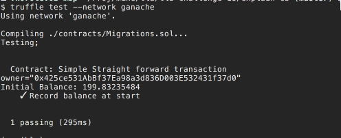

In this task we are going to trick the attackers to reveal us the decryption key
without paying any ransom.


Before we dive in, it will help to get familiar with Ethereum smart contracts and
distributed applications.  Here is some good reading material:

  * [Mastering Ethereum](https://amzn.to/2RANAkW) by by Andreas M. Antonopoulos

  * [Ethernaut](http://bit.ly/2AKVxKZ) - series of exercises, that show how to exploit various loopholes in Ethereum blockchain. Nicole Zhu prepared an excellent set of [Walkthrough Solutions](http://bit.ly/2VYfLd8) to these exercises. Try doing the exercises first before proceeding with the walkthrough.  All of the Ethernaut exercises are very valuable for gaining insight into the inner workings of the blockchain. However, for the purpose of this challenge you need to only go through exercises 1 to 8.


Our approach is to build the model of the ransomware,  and then experiment with the model to see how we can exploit it. Ethereum comes with some great tools to do it. We won't be doing any reverse engineering here because attackers gave us their source code to the smart contracts to "prove" that we will get the funds.
The only piece we are missing is the code to the *Oracle* daemon that watches blockchain and posts decryption keys when it detects that the ransom has been paid.


We will use the following tools

  * [Truffle/Solidity suite](http://bit.ly/2HcuWvY) a prime toolset for building Ethereum smart contracts using solidity language.
  * [Ganache](http://bit.ly/2FtqSFE) testing tool that lets you run the blockchain on your computer
  * [Remix IDE](http://bit.ly/2QQ9Brw) web based IDE for developing and testing smart contracts
  * [Metamask wallet](http://bit.ly/2AKEJDy) Ethereum wallet for web Chrome and Firefox browsers.
  * [NPM/Node environment](http://bit.ly/2srsqI3) Javascript development tools, needed to setup Truffle
  * For the editor you can use anything you want. I find that [Visual Studio Code](http://bit.ly/2VTE2ks)  offers the best support for Solidity language. You'll  to install Solidity/Etherium plugin separately.


Let's begin

## Preparations

Install [Node and NPM](http://bit.ly/2srsqI3) on your computer if you don't have it installed yet.  You'll need a sufficiently modern version.  I used Node version 10.7 and NPM 6.4.1.  Best way to do it on OSX is to use the brew package manager.

Also,  I like to use the desktop app version of the Ganache.  It makes it more clear to see what's going on with the dev-blockchain.   To install it simply download it from their [website](http://bit.ly/2FtqSFE)  and follow instructions.  

To install Truffle framework use the following command:

  `npm install -g truffle`


## Start the project

Once you have everything installed, create a new directory and run the following command inside:

  `trfulle init`

After the above command configures new project, copy the contracts provided by challenge to the 'contracts' directory.

Next, we are going to write some unit tests to understand the transaction flow between different contracts.  There are two ways to write unit tests for Solidity smart contracts. The first one is to use solidity language itself and the second one is to use Javascript.  We will be using the Javascript method because we'll need to simulate complex actions between different contracts and off-the-chain entities like *Victim* and *Oracle*

We will be using a 'solidity-coverage' tool to see how much code we get to cover by our tests and to make sure we explore all the edge cases. Install the tool using the following command.

  `npm install solidity-coverage`

Our initial setup is [here](http://bit.ly/2TPaHG8)

By default Ganache gives us 10 accounts with a 100 ETH balance on each.  We will use them as follows:

 * Account 0   -- ransomware OWNER,  ultimate recipient of all the ransoms
 * Account 1   -- ORACLE, an off-chain software daemon that will authorize ransom registration and release keys when ransom is paid
 * Account 2 -- VICTIM,   A person who got infected with ransomware

Note that there is a distinction between *victim account*,  *victim_id*  and *ransom contract*.  First is an Ethereum  address of the wallet that belongs to a real user.   Second is just an ID number it has no meaning in the Ethereum universe,  it is just a number,  the last is the smart contract that holds victims encrypted key

Same distinction applies to *owner* and *escrow*.   The first is the wallet address that belongs to a real person,  second is the address of the smart contract that holds the funds deposited by the victim until  withdrawn by the owner or refunded back to the victim.

Our initial test scenario is [here](http://bit.ly/2FA1Xzu). Let's look at the interesting part.

We pick arbitrary number 0x5500 as our victim ID

```[es6]
29:   let victimId = 0x5500;   // Victim ID
```

And then create initial contracts

```[es6]
40:   // Deploy contracts
39:   registry = await Registry.new(oracle, {from: owner});
40:   escrow = await Escrow.new(registry.address, oracle, {from: owner});
41:   ransom = await Ransom.new(victimId, "Hello", victim, registry.address, 55);
```

So let's measure our test coverage we have so far.  We'll use the following command:

`./node_modules/.bin/solidity-coverage`

This will compile contracts using a special version of solidity compiler that instruments the code,  and will run them against a special version of ganache that records coverage events from instrumentation. When done it creates the following report


Not much.  We just run the constructors of the contracts.  And Ransom's and Escrow constructors attempt to register with the Registry.

We can also use truffle development console to poke around the contracts.


or run tests against Ganache client



After running against local ganache, let's look at the accounts' status in the Ganache


Nothing much has changed. We see that the OWNER (account 0) was charged some small amount (0.08 ETH) for the contract deployment.   It is actually a significant amount on the real Ethereum network, about $8 USD in Jan 2019.  This is because test networks tend to have much higher gas prices.  On a real Ethereum network the gas is much cheaper.

Now let's write more tests to model the entire exchange. But before doing it let's tweak the ransom contract a bit. We see that the Ransom contract expects to be payed 100 ether to release the encryption key.

However, the default Ganache setup gives only 100 ether to each account.  Problem is that for each transaction in Ethereum we need to pay gas money. We don't have enough Ether to run the simple scenario. What we can do is change the Ransom contract to lower the ransom price. Let's set the ransom amount to 2 ether, that's more reasonable.  [Here](http://bit.ly/2TNlwbv) is the change.

Now let's study the contracts and discern the protocol.


Here is the UML diagram.

And here is the protocol

  0. At the start there are three personal accounts in the Ethereum.
The First account is the owner of the block chain, shown as OWNER.
The second account is the off-chain oracle daemon shown as ORACLE
T third account is the infected Victim account,

Also, sometime earlier, the owner registered two smart contracts being  REGISTRY
and ESCROW. REGISTRY was created first and it knows all about the OWNER and ORACLE accounts. ESCROW was created after and knows about OWNER,  ORACLE and REGISTRY.
These two contracts are shared between all the infected victims
All of the following transactions take place after infection.  Transaction boundaries are shown as green squares.  All the smart contract calls inside the square represent a single transaction and must be included in a single block. The transaction is recorded into the block chain if only if  all the calls within the box are completed successfully. Note that the ORACLE daemon acts outside of the chain, so oracle sees the events after the transaction is completed and its result is recorded in the blockchain.


1. Once a victim is infected the owner creates a copy RANSOM contract.  The following parameters are supplied to the RANSOM constructor  *victim_id*,  *encrypted_key*,  *victim address*,  *registry address* and *one time password* (*otp*). The RANSOM constructor sends a RegisterVictim message to the REGISTRY supplying *victim_id* and *otp* which in turn publishes *AuthEvent* event to the block chain.  The *AuthEvent* contents include *victim_id*,  *registry address*, *otp* and *owner address*.
Once the event is posted transaction 1 is completed.

2.  Once ORACLE sees *AuthEvent* on the blockchain it verifies *OTP* and starts a new transaction by posting an *Authcallback* message to the REGISTRY contract. The *Authcallback* message includes *victim_id*,  *ransom* and *escrow* addresses and a Boolean value of *True* that indicates successful authentication. REGISTRY forwards an *Authcallback* message to both ESCROW and RANSOM contracts.
When RANSOM receives the *Authcallback* message it posts the *RegisterRansom* message to the ESCROW.  Parameters of *RegisterRansom* include *ransom_amount*, *victim_id*, and victim address
Once ESCROW updates its tables with the information received in the RegisterRansom message,  the transaction 2 is completed.

3. At some point VICTIM gathers funds and pays the ransom by sending a *PayRansom*  message to ESCROW that includes *victim_id* and a copy of the *encrypted file*.  Together with a *PayRansom* message the victim sends requested amount of ether. Once ESCROW receives a *PayRansom* message it looks up the victim's RANSOM contract address and sends back a *RequestKey* message with no parameters. RANSOM receives the *RequestKey* message and in turn sends a *DecryptKey* message back to the ESCROW.  *DecryptKey* has two parameters *victim_id* and *encrypted key*.  Once ESCROW gets the *DecryptKey* message it posts *DecryptEvent* event to the blockchain.  *DecryptEvent* contains the following parameters  *victim_id*, *encrypted_key*, *encryptedFile*
Once *DecryptEvent* is recorded by the blockchain the transaction 3 is completed.


4. When ORACLE sees *DecryptEvent*, it decrypts the encrypted key, then uses it to decrypt the encrypted file and sends a *DecryptCallback* message to the ESCROW. *DecryptCallback* message includes *victim_id*,  *decrypted_key* and Boolean value of true that indicates that oracle decrypted the file successfully.
Once ESCROW receives *DecryptCallbackEvent* with *victim_id* and decrypted key it stores the key on the blockchain and sends a *FulfillContract* message to the RANSOM.
At this point transaction 4 completes.

5. After one or more contract have been fulfilled the OWNER can send a 'Withdraw funds' message to the ESCROW to request the collected ether to be transferred back to the OWNER account.
A *WithdrawFunds* message includes the amount to be withdrawn and the owner account address. Once ESCROW receives a WithdrawFunds message it transfers the requested amount to the OWNER account at any point after.
Transaction 5 is completed.

6. Victim can call RANSOM contract's to getDecryptionKey method to request decryption key.
When RANSOM gets getDecryptionKey call, it forwards it to the ESCROW which in turn returns back stored decryption key sent by the ORACLE. This is not shown on the diagram,  because it is a 'view' only transaction that does not affect the state of the blockchain,  therefore it is not even seen by miners.

Let's [implement](http://bit.ly/2RR5GPO) the above scenario as a test.

And let's measure the coverage again.


Much better this time.  We have covered must of the code except for some minor edge cases and failures.

Running this scenario on the local Ganache a couple of times shows that victim funds have depleted by 4 ether and the owner account balance has increased by the same amount.


You seeing a decrease of 4 and not 2, because I ran the scenario twice before taking this screenshot.
Note that 0.33 ETH went missing.  Gas prices on local Ganache are very high.

So having completed the test, let's see how can we exploit this

Nothing from [standard bag of tricks](http://bit.ly/2AKVxKZ) seems to work.
Maybe the solution lies in the interaction of different pieces.


Let's look at the message flow chart again.


If we can slip in our own Ransom contract with the amount set to zero,  we should be able to get the key with paying 0 ether in ransom.  Which means not paying it at all,  except for a small amount used for the gas.

We already saw that by modifying the Escrow contract we can set the ransom amount to 2 ether only. Let's try setting it to something even lower, how about 0 wei. But first let's try it in our simulation environment.

Let's make a new contract and call it ZeroRansom, by making a copy of a standard Ransom contract, and then modify it to demand zero Wei for the ransom.

[Here](http://bit.ly/2SZGAfa) is the modification.

Let's give it a try.


It works! We have got the key by paying 0 WEI.

Let's look at the balances


Looks like everybody's balance is still close to 100 ETH.  Just some gas money was spent.

So, if we can deploy this 'improved' contract instead of the standard escrow contract, we can recover the key without paying any money.

Looks like Ransom contracts self-register on construction. It seems that all we need to do is just construct it with standard parameters.

To explore our progress on the real block chain we will use our exploratory notebook we have developed for [Task 4](../codebreaker2018_task4/).

Use [this version](http://bit.ly/2CkZKF6) to run it on your own computer.  Or you can use [this version](http://bit.ly/2D12FnY) to run it on Google Collaboratory platform without downloading or installing anything.

For that we need to set us up with [Metamask wallet](http://bit.ly/2AKEJDy) and [Remix IDE](http://bit.ly/2QQ9Brw). We'll use the Web version of Remix IDE.

First follow instructions on the Challenge resources page to install Metmask client and connect it to the Challenge blockchain. Then click on [this link](http://bit.ly/2QQ9Brw) to open Remix IDE.

You will see something like this:


Click on a button pointed by the arrow to upload the provided contracts to the IDE storage.


Upload all the contracts Ransom, Escrow, ZeroRansom and Registry. Then make sure that the version of solidity compiler used by IDE actually matches the versions that our contracts are written in.


Click on this button here.


And select correct version 0.4.24. You need to do this because Solidity is a very rapidly evolving platform,  the language itself changes almost every month, to the point that it
source code could quickly become unparsable by the current compilers.

Open all the four contracts you just have uploaded in the tabs by clicking on their filenames
and then once all of them are opened press (ctrl-s / cmd-s) to compile.

If it worked correctly you should see something like this.


Now, let's try to talk to the existing contacts. Switch to the run tub of the IDE by selecting 'Run' item in the top right menu.


We will not be deploying our contracts to the blockchain,  rather we'll attach newly compiled code to the already deployed contracts.  For that we need contract addresses.  
We can get Escrow and Ransom addresses from the ransom note left to us by the attackers.
To attach to the Escrow, select it from the list of contracts and then enter the address next to the 'At address' button.   Once done click on the green 'At address' button to make an attachment.

Do the same for the Ransom contract using the address given in the ransom note
We are not given the address of the registry, but it can be easily found via our exploratory notebook.


If you did everything  correctly, you should see something like this.


To verify that we have attached to the correct contracts try invoking some of the contract's methods. To invoke a method, expand the contract by clicking a small triangle button on the left side. Then select the name of the method you want to invoke,  if required enter parameter values,  then click on the method name to invoke it.

Here is an example of a method invocation:


Note that the Escrow contract doesn't have any executable methods open to the public except for the payRansom which requires payment.

Let's try to deploy our 'patched' version of the ransom contract.

To deploy, it first select ZeroRansom contract from contract list, then expand the Deploy dialog, and then enter the parameters for the contract's constructor.

  * Use the *victim_id* from the ransom note
  * For the encryption key use the one you got by solving [task 2](../codebreaker2018_task2/)
  * *victim_adrress* comes from the ransom note as well
  * the registry address comes from the exploratory notebook shown above
  * Now the only parameter left is authToken. Let's use the information given to us in [task 3](../codebreaker2018_task3/)

You should get something like this:


Once you enter these parameters, press the green transact button
Since contract deployment requires gas money,  you get the metamask prompt asking for confirmation to spend $.20 for gas


Press confirm, and wait a little bit.  In a few seconds you should see notification from the metamask that the transaction has been completed. Click on the metamask icon in your browser extension bar, to confirm that our contract was deployed.


You should also see a new ZeroRansom contract in the deployed contract list of Remix IDE.
Now let's try to interact with it.


There seems to be a problem. The contract doesn't know its attached Escrow, it is not authenticated,  and getDecryptionKey method just fails straight away.
Calling 'getRansomForVictim' method of the registry contract gives the old contract address not the new one. This doesn't seem right.

Let's use the exploratory notebook to check the state of the blockchain.
More specifically let's see the AuthEvents.

Our AuthEvent was posted correctly.


And this is the callback event coming from Oracle.


The good news is that Oracle did respond to our attempt to register, the bad news is that it did not recognize it as valid registration.

This is because the OTP value is time sensitive,  and only valid within a very short period after it was generated.  We need to find a way to generate them ourselves.

### Side note

Querying events on the block chain could involve scanning every single block stored on the chain.  You could get an overwhelming number of results or more likely the client will just drop your request if number of blocks is too large.

In order to avoid this, we must limit the range of blocks we are scanning for the events.
That's what `fromBlock` and `toBlock` parameters are used for in the above examples.
We always scan to the most recent block but we need to set the starting block to something mined not very long time ago.

Use the exploratory notebook to find out the most recent block number.


Then subtract a 1000 from this value and use the new value with the fromBlock parameter.

So back to our task.  

### Making oracle accept 'fake' contracts

We need Oracle to accept deployment of our fake contracts.  Looks like we cannot reuse old OTPs, probably because they expire quickly.  We need to reverse engineer gen_otp function of libclient_crypt.so, so that we can generate the OTP values ourselves.

I'll skip the Radare part,  it is very similar to what we did in [Task 2](../codebreaker2018_task2).

[Here](http://bit.ly/2RrPdCk) is extracted code and test routines.

To test the code we need to know a valid  OTP code and the exact time it was generated
We can get this information from the `victim_identification` file given
to us in [Task 3](../codebreaker2018_task3/).

One small obstacle,  the `gen_otp` routine requires the timestamp value to be in epoch time format, not a human readable string. We'll use the [Epoch converter](http://bit.ly/2FAoHPS) web app to convert it.  Once we have it we can run out test to validate the model


Now we can try registering the the Ransom contract again. All we need is the current OTP.

To get it let's head over to the [Epoch converter](http://bit.ly/2FAoHPS) site again
and request a new timestamp for the time that is about 2-3 minutes from now.
Since we don't know at what time the OTP expires, lets use 35 for the seconds value to match the number that we saw in the `victims_information` file.


Then we change our test to use this new timestamp value and run the model again.


We got our new OTP.

Let's try deploying this contract again,  using the same arguments as before, but with the new OTP value.

After deployment is confirmed, let's look at the blockchain events again


Great, this time it worked.

Now let's poke at it with RemixIDE.


Much better, now the new contract is authenticated and attached to the Escrow.

All we need to do now is to call payRansom method of the escrow contract giving it 0 ether.   Note that payRansom contract has two parameters `vicitmId` which we know and the `encryptedFile` which is given to us in this assignment. There is a small problem with `encryptedFile`. It's a JSON string, and RemixIDE doesn't work with them properly. It just passed them into the call verbatim, which results in an invalid JSON-RPC call.  To make it work we need to first *JSON stringify* it.

We can use the browser console for that.

If you work in Chrome on Mac, press Cmd-Ctrl-I then follow example below.


Cut and paste output of the `JSON.stringify` to the REMIX IDE encrypted file parameter
and press the green *payRansom* button.

Again you get a Metmask prompt asking whether it's ok to spend a few cents on gas.
Once the transaction is confirmed, let's have a look at our ransom contract again.


All we need to do is press the getDecryptionKey button get the key and submit it as the answer.


And now on to the final [Task 7](./codebreaker2018_task7)
