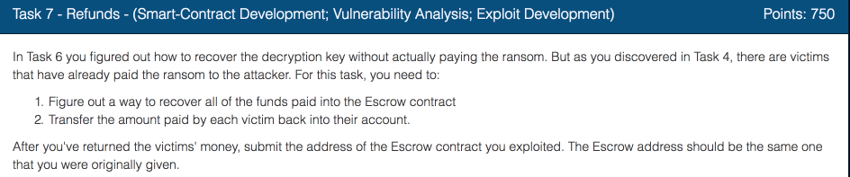
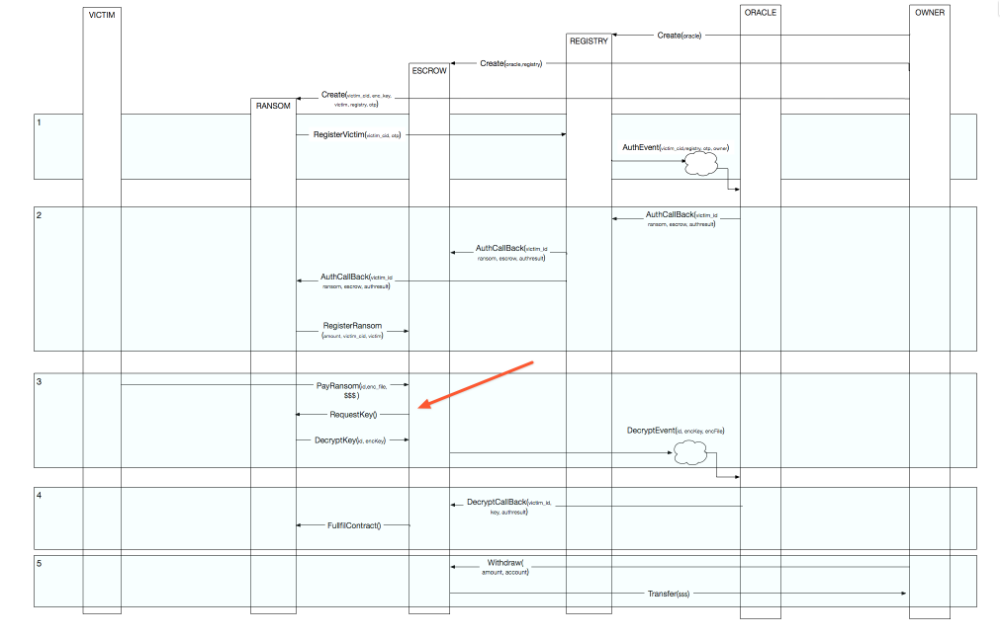
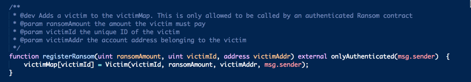
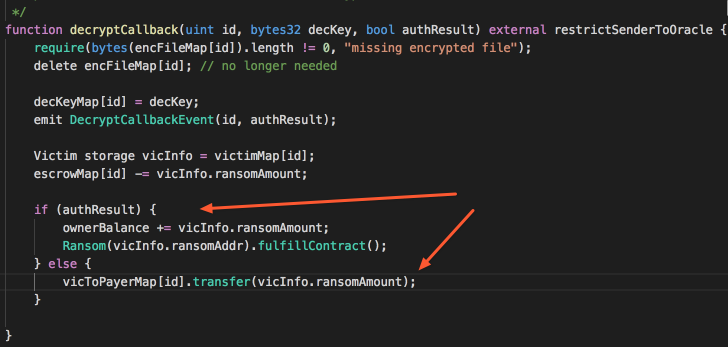
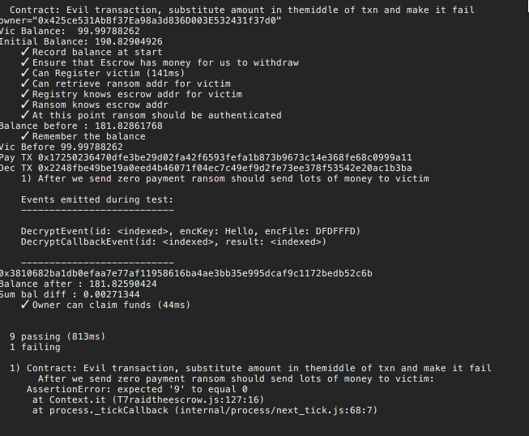
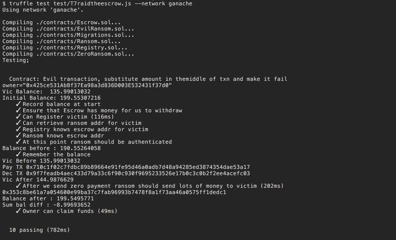
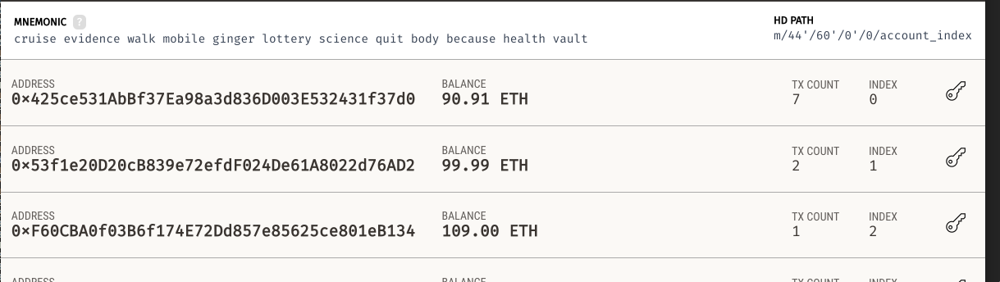
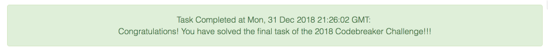

Our final task is to take over Escrow contract and refund the money back to the
victims who payed.

After completing [task 6](../codebreaker2018_task6), the solution of this task is
pretty simple.  

Let's recap of what we have know so far:

  * We understand the entire message flow of the ransomware
  * We can substitute ransom contracts with our 'patched' versions
  * We cannot change anything about the Escrow contract itself
  * Looks like that the attacker have not withdrawn the money from the Escrow

So, what we need to do is:

  * Find a flaw in the ransomware blockchain  
  * Exploit the flow to take  the money from the Escrow  
  * Refund it back to victims

Let's take a look at the message diagram:

and this method

as well as this one

Looks like the attackers decided to be "Gentelmen" and provided refund option in case they fail to decrypt the encrypted file. Also it looks like the ransom contracts can re-register themselves as many times as they want given that they have been authenticated once by the Oracle.

So let's modify our ransom contract again to do the following

1) Register with the Escrow as zero ransom contract
2) Call *payRansom* on the escrow giving it 0 ether
3) When Escrow calls our *RequestKey* method we will first we will give a corrupted version of the key to the Escrow and then re-register ourselves as contract with Ransom amount of 300 ETH.
4) Oracle will fail to decrypt and will indicate failure to the Escrow by calling *DecryptCallbackMethod* with authResult = False
5) Escrow receive failure notification and automatically refund us.  However because we changed the refund amount at step 3.  The Escrow is going to refund us with 300 ETH not zero which we initially paid
6) PROFIT

This is a blockchain equivalent of going to the store, changing the price sticker to 1 penny,  buying the item,  tampering with the receipt to make it look like we bought it for $3000,  damaging the item,  returning it back to the store for the refund of $3000.

Note that operations in step 3 have to be done exactly in this order.  This is because registering new ransom contract creates a new contract record in the `victimMap` mapping.   Which means the Escrow will consider this newly registered contract to be unauthenticated.  So it will refuse the decryptKey request from the new contract.   Doing these operations in the  order listed in step 3 looks like it's unreliable, but it's actually not.   We are guaranteed that our substitution  of ransom amount is going to happen before the oracle gets the decrypt event by the atomic nature of the Ethereum transactions. All changes to the  contracts and posting of the events are made public once the block is acknowledged by  the miners.

Here is our test for this scenario [http://bit.ly/2Db5Eu4].

And of course it fails

It fails because we didn't 'patch' our contract yet.

Again we are sticking to the principles of TDD. First we run the test to illustrate the problem. We run this test to make sure it fails,  if it doesn't fail it was not a
valid test, we do whatever is needed to make the test pass.

The 'patch' for the Ransom contract is [here](http://bit.ly/2sBg68d)

We run the test again.

And it passes this time.

Let's check the account balances

Great, we managed to wrestle 9 ether out of the owner. Even better, because the transfer is done in the context of *DecryptCallback*  Oracle is paying for the gas.

Now let's go and use this exploit on the real blockchain.

Note that we transferred only 9 ether except of 300  requested by the assignment.  This is because of default ganache settings of 100 ether on each account.   I tried to make this walkthrough as simple as possible,  but still educational.  Changing default ganache settings would make this walkthrough  more complex than it already is.

 * Go back to RemixIDE and upload our new EvilRansom contract to the workspace
 * Deploy the new contract using the same technique we used in [task 6](../codebreaker2018_task6)
 * Verify that new contract has deployed by checking blockchain events using our notebook or just  call the method *getEscrowAddressForVictim* of the Registry to verify that new contract has registered correctly
 * Once you verified,  that the new contract is there.   Make a 0 either payment to the escrow and enjoy you 300 ETH refund back.
 * In order to get the credit for this task you have to actually send 100 ether to each of the victims who paid the ransom. Can't keep to yourself.
 * Once you send the ether to victims.  Go ahead and submit your escrow contract address to the challenge

Sorry no screenshots for the lasts steps.  I am writing more than a week after completing the challenge.   Applying Task 7 exploit to the real blockchain permanently corrupts the Escrow contract so it is not possible to repeat this again.

If you followed along, now you have completed entire challenge. Congratulations!
